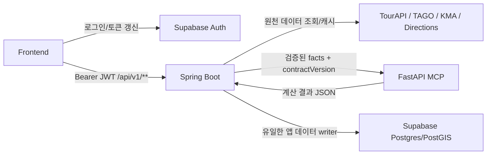

# 타이밍제주 Spring REST API 명세 v1.1

## 1. 문서 상태

| 항목 | 값 |
| --- | --- |
| 기준 화면 | Figma `관광데이터 공모전` 와이어프레임, 디자인, 컴포넌트, 댓글 스레드 |
| Public API 담당 | Spring Boot |
| 인증 | Supabase Auth JWT |
| DB | Supabase Postgres + PostGIS |
| 계산 서버 | FastAPI MCP, Spring 내부 호출 전용 |
| 내부 전송 | Stateless MCP Streamable HTTP `/mcp` |
| Base path | `/api/v1` |
| 시간대 | `Asia/Seoul` |
| 문서 버전 | `1.1` |

## 2. 확정된 제품 결정

- 로그인: 이메일/비밀번호와 `kakao`, `naver`, `google` 소셜 로그인.
- 별도 로그인 아이디와 생년월일은 받지 않는다.
- 비밀번호 재설정은 Supabase Auth 이메일 복구 흐름을 사용한다.
- 사용자가 선택하는 주 교통수단은 `public_transit`, `rental_car`, `taxi`다.
- 세 교통수단은 복수 선택할 수 있고 `priority`와 `primary`로 우선순위를 정한다.
- `walk`는 주 교통수단이 아니라 구간 이동수단이다.
- AI 1차 범위는 구조화 입력 기반 Day 일정 생성이다.
- 대화형 일정 생성은 DB/API 계약만 설계하고 구현은 2차로 둔다.
- 위험도, 일정 생성, 가능성, 추천, 복구안, 라이브 재계산 알고리즘은 FastAPI MCP가 담당한다.
- 관심 장소는 시간 없이 저장할 수 있지만 일정 후보를 봉인하려면 모든 항목의 위치, 시작/종료, 체류시간과 연속 이동 구간이 필요하다.
- 자동 복구는 기존 순서를 유지한다. `move_day`, 장소 대체/제외, 체류 단축, 교통수단 변경은 허용하지만 자동 `reorder`는 하지 않는다.

## 3. 책임 경계



| 영역 | Supabase Auth | Spring Boot | FastAPI MCP |
| --- | --- | --- | --- |
| 회원가입/로그인/토큰 갱신 | 소유 | JWT 검증 | 접근 금지 |
| 공개 REST API | - | 소유 | 직접 노출 금지 |
| 사용자/일정 권한 검사 | 사용자 원본 | 소유 | Spring이 전달한 범위만 신뢰 |
| 외부 관광/교통/날씨 API | - | 호출, 정규화, 캐시 | 직접 호출 금지 |
| 일정/위험/추천 알고리즘 | - | 입력 조립, 출력 검증 | 소유 |
| DB 읽기/쓰기 | Auth 스키마 | 앱 데이터 읽기/쓰기 | 직접 접근 금지 |
| 트랜잭션/버전 적용 | - | 소유 | 후보 JSON만 반환 |

## 4. 핵심 데이터 규칙

1. `trip_schedule_versions`와 그 하위 `trip_items`, `trip_legs`는 봉인 후 불변이다.
2. 사용자 수정, AI 후보 적용, 복구안 적용은 기존 행을 수정하지 않고 새 일정 버전을 만든다.
3. 한 여행에는 `active` 버전이 정확히 하나이며 `trip_plans.active_schedule_version_id`와 일치해야 한다.
4. FastAPI는 DB UUID를 생성하지 않는다. 응답의 `clientRef`를 Spring이 UUID로 변환한다.
5. 라이브 실행 상태는 `trip_item_progress`, 이력은 `trip_execution_events`에 저장한다.
6. FastAPI 장애나 외부 API 장애가 나도 활성 일정을 덮어쓰지 않는다.
7. `candidate`/`active` 봉인 시 위치와 시간, 일별 연속 순번, 겹치지 않는 항목, 인접 항목을 연결하는 완전한 leg를 DB가 검증한다.

## 5. 상태값

| API | DB | UI | 의미 |
| --- | --- | --- | --- |
| `safe` | `green` | 안전 | 수행 가능, 버퍼 충분 |
| `caution` | `yellow` | 주의 | 수행 가능하지만 조정 권장 |
| `danger` | `red` | 위험 | 수행 불가 또는 큰 수정 필요 |

비동기 실행 상태는 `queued`, `running`, `succeeded`, `failed`, `cancelled`를 사용한다.

## 6. 공통 계약

### 6.1 인증 헤더

```http
Authorization: Bearer <supabase_access_token>
Content-Type: application/json
Accept: application/json
```

### 6.2 멱등성 헤더

생성, 계산, 적용, 라이브 이벤트 API에는 아래 헤더가 필요하다.

```http
Idempotency-Key: 018f6f2a-60a0-7f5b-8c61-8f548f34bc31
```

같은 사용자, 같은 경로, 같은 키의 재요청은 최초 결과를 반환한다. 본문이 달라지면 `409 IDEMPOTENCY_KEY_REUSED`를 반환한다.

### 6.3 커서 페이지네이션

Request:

```http
GET /api/v1/places?query=성산&size=20&cursor=eyJpZCI6Ii4uLiJ9
```

Response:

```json
{
  "items": [],
  "page": {
    "size": 20,
    "hasNext": false,
    "nextCursor": null
  }
}
```

`size`는 기본 20, 최댓값 50이다. 무한 스크롤 화면에는 offset을 사용하지 않는다.

### 6.4 공통 에러

```json
{
  "type": "https://api.timing-jeju.example/problems/schedule-version-conflict",
  "title": "일정 버전이 변경되었습니다.",
  "status": 409,
  "detail": "최신 일정을 다시 조회한 뒤 변경을 재시도해 주세요.",
  "instance": "urn:timing-jeju:problem:4bf92f3577b34da6a3ce929d0e0e4736",
  "code": "SCHEDULE_VERSION_CONFLICT",
  "traceId": "4bf92f3577b34da6a3ce929d0e0e4736",
  "fieldErrors": []
}
```

오류 응답은 위 8개 필드만 사용하고 `message`나 도메인별 추가 envelope 필드를 넣지 않는다. `traceId`는 32자리 소문자 hex이며 `X-Trace-Id` 응답 헤더와 같아야 한다. `instance`는 같은 값을 접미사로 사용한 occurrence URI `urn:timing-jeju:problem:<traceId>`다.

### 6.5 비동기 실행 응답

```json
{
  "runId": "64000000-0000-0000-0000-000000000001",
  "status": "queued",
  "pollUrl": "/api/v1/trips/50000000-0000-0000-0000-000000000001/generation-runs/64000000-0000-0000-0000-000000000001",
  "createdAt": "2026-08-03T09:00:00+09:00"
}
```

## 7. 화면/API 매트릭스

| Figma 기능 | Spring API | 주요 테이블 | FastAPI tool |
| --- | --- | --- | --- |
| 로그인/회원가입/비밀번호 재설정 | Supabase Auth SDK, `GET /me` | `auth.users`, `user_profiles`, `social_accounts` | - |
| 마이페이지 | `GET/PATCH/DELETE /me`, `GET /trips` | `user_profiles`, `trip_plans` | - |
| 지도 탐색/무한 스크롤 | `GET /places` | `tour_places`, `place_images` | - |
| 장소 상세 | `GET /places/{placeId}` | `place_details`, `place_operating_hours`, `place_stop_links` | - |
| 관심 장소 | `GET/POST/PATCH/DELETE /saved-places` | `saved_places` | - |
| 일정 기본 입력 | `POST /trips`, `PUT /preferences` | `trip_plans`, `trip_preferences`, `trip_transport_modes` | - |
| 항공/선박 도착·출발 | `PUT /transport-event` | `trip_transport_events` | 일정 생성 facts |
| 복수 숙소 | `POST/PATCH/DELETE /accommodations` | `trip_accommodations` | 일정 생성 facts |
| 희망 장소 확정 | `PUT /place-preferences` | `trip_place_preferences` | 일정 생성 facts |
| Day 일정 한 번에 생성 | `POST /generation-runs` | `itinerary_generation_runs`, `trip_schedule_versions` | `generate_day_itinerary` |
| 일정 수정/삭제/순서 변경 | Schedule mutation API | `trip_schedule_versions`, `trip_items`, `trip_legs` | 필요 시 `revise_day_itinerary` |
| 가능성 결과 | `POST /feasibility-runs` | `compute_runs`, `risk_events`, `trip_weather_impacts` | `calculate_feasibility` |
| 위험 이동 구간 상세 | `GET /legs/{legId}` | `trip_legs`, 버스 원천 테이블 | - |
| 빈 시간 추천 | `POST /spare-time-runs` | `recommendation_candidates` | `recommend_spare_time` |
| 수정안 비교 | `POST /recovery-runs` | `recovery_options`, `recovery_option_changes` | `generate_recovery_options` |
| 수정안 적용 | `POST /recovery-options/{optionId}/apply` | 일정 버전 전체 | - |
| 라이브 타임라인/도착 | `GET /live-state`, `POST /execution-events` | `trip_item_progress`, `trip_execution_events` | - |
| 놓침 재계산 | `POST /live-recalculation-runs` | `live_state_snapshots`, 계산 결과 | `recalculate_live_state` |

### 7.1 Spring에서 FastAPI로 가는 공통 흐름

1. Spring REST가 Supabase JWT, 소유권, `Idempotency-Key`와 요청값을 검증한다.
2. DB에 `queued` run을 저장하고 프런트에는 즉시 `202 runId/pollUrl`을 반환한다.
3. Spring worker가 일정/사용자 입력을 읽고 TourAPI/TAGO/KMA/길찾기 facts를 최신화한다.
4. 원천 `raw_payload`를 제외한 정규화 facts와 정책을 tool Request DTO로 조립한다.
5. `contractVersion`, `requestId`, `factsAsOf`, `inputHash`, `trace`를 붙여 FastAPI `/mcp`의 `tools/call`을 호출한다.
6. MCP `result.structuredContent`의 schema, hash, 참조 ID와 수치 정합성을 검증한다.
7. 결과와 run 상태를 한 transaction으로 저장한다. FastAPI는 DB에 직접 접근하지 않는다.
8. 프런트 polling 요청에는 저장된 결과를 공개 REST 응답 형식으로 변환해 반환한다.

MCP wire envelope, 내부 JWT, 실제 `calculate_feasibility` 송수신 JSON과 저장 매핑은 [Spring-FastAPI MCP 내부 연동 명세](./timing-jeju-spring-fastapi-integration-contract.md)를 기준으로 한다.

### 7.2 공개 API별 내부 MCP 호출

| Spring 공개 API/동작 | FastAPI MCP Tool | Spring 입력 원천 | FastAPI 결과 | Spring 저장 |
| --- | --- | --- | --- | --- |
| `POST /generation-runs` | `generate_day_itinerary` | trip 조건, Day, 장소, 숙소, 도착출발, 이동/날씨 facts | Day 전체 items/legs 후보 | generation run/candidate/version |
| 일정 편집 AI 보정 | `revise_day_itinerary` | 현재 Day 전체 일정, 수정 지시, 최신 facts | 전체 Day 수정안과 diff | 새 schedule version |
| 후보 봉인 전 내부 검증 | `validate_itinerary` | 전체 items/legs와 hard constraint facts | errors/warnings/normalized result | 통과 시에만 봉인 |
| `POST /feasibility-runs` | `calculate_feasibility` | 일정, 이동, 버스 도착, 날씨, 정책 | score/level/risk/weather impacts | compute/risk/weather tables |
| `POST /spare-time-runs` | `recommend_spare_time` | 빈 시간, 기준 위치, 후보 장소/왕복 facts | 삽입 가능한 후보 순위 | recommendation candidates |
| `POST /recovery-runs` | `generate_recovery_options` | active 일정, 진행 상태, 위험, 현재 위치/facts | 완전한 복구 일정과 diff | recovery/proposed version |
| `POST /live-recalculation-runs` | `recalculate_live_state` | 현재 시각/위치, 진행 상태, 최신 facts | next action/risk/recovery 필요 여부 | live snapshot/results |
| Phase 2 대화 입력 | `parse_trip_intent` | 사용자 메시지, 현재 조건, 허용 ID | 구조화 intent/확인 질문 | 확인 전 대화 테이블만 |

### 7.3 내부 호출에서 보내지 않는 데이터

- Supabase access/refresh token과 provider OAuth token.
- 이메일, 닉네임, 소셜 provider profile.
- 외부 API key와 Supabase service role key.
- TourAPI/TAGO/KMA의 전체 `raw_payload`.
- 알고리즘에 필요하지 않은 정밀 위치 이력과 MCP prompt/completion 원문.

## 8. 전체 Endpoint 목록

`MCP 호출`은 해당 HTTP 요청을 처리하면서 Spring이 FastAPI MCP tool을 직접 실행하는지를 뜻한다. 비동기 실행 결과를 읽는 polling GET과 후보를 DB에 적용하는 API는 `미호출`이다.

| Domain | Method | Path | Auth | MCP 호출 | MCP Tool | 결과 | DB/외부 의존성 |
| --- | --- | --- | --- | --- | --- | --- | --- |
| Profile | GET | `/api/v1/me` | 필수 | 미호출 | - | `200` | profile/social |
| Profile | PATCH | `/api/v1/me` | 필수 | 미호출 | - | `200` | profile |
| Profile | DELETE | `/api/v1/me` | 필수 | 미호출 | - | `202` | Auth + owned data |
| Legal | GET | `/api/v1/legal-documents` | 선택 | 미호출 | - | `200` | legal |
| Legal | PUT | `/api/v1/me/consents` | 필수 | 미호출 | - | `200` | consent |
| Places | GET | `/api/v1/places` | 선택 | 미호출 | - | `200` | TourAPI cache/PostGIS |
| Places | GET | `/api/v1/places/{placeId}` | 선택 | 미호출 | - | `200` | TourAPI/TAGO cache |
| Saved | GET | `/api/v1/saved-places` | 필수 | 미호출 | - | `200` | saved places |
| Saved | POST | `/api/v1/saved-places` | 필수 | 미호출 | - | `201` | saved places |
| Saved | PATCH | `/api/v1/saved-places/{placeId}` | 필수 | 미호출 | - | `200` | saved places |
| Saved | DELETE | `/api/v1/saved-places/{placeId}` | 필수 | 미호출 | - | `204` | saved places |
| Trips | GET | `/api/v1/trips` | 필수 | 미호출 | - | `200` | trip list |
| Trips | POST | `/api/v1/trips` | 필수 | 미호출 | - | `201` | trip aggregate |
| Trips | GET | `/api/v1/trips/{tripId}` | 필수 | 미호출 | - | `200` | trip aggregate |
| Trips | PATCH | `/api/v1/trips/{tripId}` | 필수 | 미호출 | - | `200` | trip root |
| Trips | DELETE | `/api/v1/trips/{tripId}` | 필수 | 미호출 | - | `204` | trip aggregate |
| Trips | PUT | `/api/v1/trips/{tripId}/preferences` | 필수 | 미호출 | - | `200` | preferences/modes |
| Trips | PUT | `/api/v1/trips/{tripId}/place-preferences` | 필수 | 미호출 | - | `200` | place preferences |
| Trips | PUT | `/api/v1/trips/{tripId}/transport-event` | 필수 | 미호출 | - | `200` | arrival/departure + regeneration signal |
| Trips | DELETE | `/api/v1/trips/{tripId}/transport-event` | 필수 | 미호출 | - | `200` | query eventType + regeneration signal |
| Stay | POST | `/api/v1/trips/{tripId}/accommodations` | 필수 | 미호출 | - | `201` | accommodations |
| Stay | PATCH | `/api/v1/trips/{tripId}/accommodations/{accommodationId}` | 필수 | 미호출 | - | `200` | accommodations |
| Stay | DELETE | `/api/v1/trips/{tripId}/accommodations/{accommodationId}` | 필수 | 미호출 | - | `204` | accommodations |
| Schedule | GET | `/api/v1/trips/{tripId}/schedule` | 필수 | 미호출 | - | `200` | version/items/legs |
| Schedule | POST | `/api/v1/trips/{tripId}/schedule-items` | 필수 | 미호출 | - | `201` | new user-edit version |
| Schedule | PATCH | `/api/v1/trips/{tripId}/schedule-items/{itemId}` | 필수 | 미호출 | - | `200` | new user-edit version |
| Schedule | DELETE | `/api/v1/trips/{tripId}/schedule-items/{itemId}` | 필수 | 미호출 | - | `200` | new user-edit version |
| Schedule | PUT | `/api/v1/trips/{tripId}/schedule-order` | 필수 | 미호출 | - | `200` | new user-edit version |
| Schedule | POST | `/api/v1/trips/{tripId}/schedule-items/{itemId}/move` | 필수 | 미호출 | - | `200` | new user-edit version |
| Generation | POST | `/api/v1/trips/{tripId}/generation-runs` | 필수 | 호출 | `generate_day_itinerary` | `202` | FastAPI MCP |
| Generation | GET | `/api/v1/trips/{tripId}/generation-runs/{runId}` | 필수 | 미호출 | - | `200` | run/candidates |
| Generation | POST | `/api/v1/trips/{tripId}/generation-runs/{runId}/candidates/{candidateId}/apply` | 필수 | 미호출 | - | `200` | atomic version apply |
| Feasibility | POST | `/api/v1/trips/{tripId}/feasibility-runs` | 필수 | 호출 | `calculate_feasibility` | `202` | TAGO/KMA/FastAPI |
| Feasibility | GET | `/api/v1/trips/{tripId}/feasibility-runs/{runId}` | 필수 | 미호출 | - | `200` | compute results |
| Route | GET | `/api/v1/trips/{tripId}/legs/{legId}` | 필수 | 미호출 | - | `200` | route/arrival cache |
| Recommend | POST | `/api/v1/trips/{tripId}/spare-time-runs` | 필수 | 호출 | `recommend_spare_time` | `202` | FastAPI MCP |
| Recommend | GET | `/api/v1/trips/{tripId}/spare-time-runs/{runId}` | 필수 | 미호출 | - | `200` | candidates |
| Recovery | POST | `/api/v1/trips/{tripId}/recovery-runs` | 필수 | 호출 | `generate_recovery_options` | `202` | FastAPI MCP |
| Recovery | GET | `/api/v1/trips/{tripId}/recovery-runs/{runId}` | 필수 | 미호출 | - | `200` | options/diffs |
| Recovery | POST | `/api/v1/trips/{tripId}/recovery-options/{optionId}/apply` | 필수 | 미호출 | - | `200` | atomic version apply |
| Live | GET | `/api/v1/trips/{tripId}/live-state` | 필수 | 미호출 | - | `200` | progress/latest snapshot |
| Live | POST | `/api/v1/trips/{tripId}/execution-events` | 필수 | 미호출 | - | `200` | progress/events |
| Live | POST | `/api/v1/trips/{tripId}/live-recalculation-runs` | 필수 | 호출 | `recalculate_live_state` | `202` | latest facts/FastAPI |
| Live | GET | `/api/v1/trips/{tripId}/live-recalculation-runs/{runId}` | 필수 | 미호출 | - | `200` | snapshot/recovery |
| Weather | GET | `/api/v1/weather/forecast` | 선택 | 미호출 | - | `200` | KMA cache |

## 9. 상세 계약: Profile/Legal

### 9.1 `GET /api/v1/me`

Request:

```http
GET /api/v1/me
Authorization: Bearer <supabase_access_token>
```

Response `200`:

```json
{
  "userId": "09000000-0000-0000-0000-000000000001",
  "email": "demo@timing-jeju.local",
  "nickname": "타이밍제주 데모",
  "profileImageUrl": null,
  "locale": "ko-KR",
  "providers": [
    "email",
    "kakao"
  ],
  "onboardingCompleted": true
}
```

### 9.2 `PATCH /api/v1/me`

Request:

```json
{
  "nickname": "제주여행자",
  "profileImageUrl": "https://cdn.example.com/profiles/me.jpg",
  "locale": "ko-KR"
}
```

Response `200`:

```json
{
  "userId": "09000000-0000-0000-0000-000000000001",
  "nickname": "제주여행자",
  "profileImageUrl": "https://cdn.example.com/profiles/me.jpg",
  "locale": "ko-KR",
  "updatedAt": "2026-08-03T09:01:00+09:00"
}
```

### 9.3 `DELETE /api/v1/me`

Request:

```json
{
  "confirmation": "DELETE_MY_ACCOUNT"
}
```

Response `202`:

```json
{
  "status": "accepted",
  "deletionRequestId": "01JZQ3CM4C9N6N5S7XJ9W1FB08",
  "requestedAt": "2026-08-03T09:02:00+09:00"
}
```

Spring은 앱 데이터 삭제와 Supabase Admin API 사용자 삭제를 서버 작업으로 처리한다.

### 9.4 `GET /api/v1/legal-documents?locale=ko-KR`

Response `200`:

```json
{
  "items": [
    {
      "documentId": "09200000-0000-0000-0000-000000000001",
      "type": "terms",
      "version": "1.0",
      "title": "서비스 이용약관",
      "contentUrl": "https://timing-jeju.example/legal/terms/1.0",
      "required": true,
      "effectiveAt": "2026-08-01T00:00:00+09:00"
    }
  ]
}
```

### 9.5 `PUT /api/v1/me/consents`

Request:

```json
{
  "consents": [
    {
      "documentId": "09200000-0000-0000-0000-000000000001",
      "agreed": true
    },
    {
      "documentId": "09200000-0000-0000-0000-000000000002",
      "agreed": true
    }
  ]
}
```

Response `200`:

```json
{
  "requiredConsentsSatisfied": true,
  "updatedAt": "2026-08-03T09:03:00+09:00"
}
```

### 9.6 마이페이지 화면 구성

마이페이지 전용 집계 endpoint를 추가하지 않고 기존 소유 API를 조합한다.

| 화면 영역 | API/담당 | 데이터 |
| --- | --- | --- |
| 프로필/연결 로그인 | `GET /api/v1/me` | nickname, email, image, providers |
| 프로필 수정 | `PATCH /api/v1/me` | nickname, image, locale |
| 내 여행 | `GET /api/v1/trips` | 예정/진행/완료/보관 여행 |
| 저장한 장소 | `GET /api/v1/saved-places` | 메모, 태그, 희망 Day 포함 |
| 약관 동의 | `GET /legal-documents`, `PUT /me/consents` | 필수 동의 충족 여부 |
| 로그아웃/비밀번호 재설정 | Supabase Auth SDK | Spring endpoint 없음 |
| 회원 탈퇴 | `DELETE /api/v1/me` | 앱 데이터와 Auth 사용자 삭제 작업 |

마이페이지 초기 화면은 프런트가 `GET /me`, `GET /trips?size=3`, `GET /saved-places?size=3`를 병렬 호출한다. 별도 집계 API는 실제 성능 측정 후 BFF가 필요할 때만 추가한다.

## 10. 상세 계약: Places/Saved Places

### 10.1 `GET /api/v1/places`

Request:

```http
GET /api/v1/places?query=성산&category=tourist_attraction&regionCode=seongsan&lat=33.458111&lng=126.941516&radiusMeters=10000&size=20
```

Response `200`:

```json
{
  "items": [
    {
      "placeId": "20000000-0000-0000-0000-000000000002",
      "contentId": "126435",
      "name": "성산일출봉",
      "category": "tourist_attraction",
      "regionCode": "seongsan",
      "regionLabel": "성산",
      "address": "제주특별자치도 서귀포시 성산읍 일출로 284-12",
      "location": {
        "lat": 33.458111,
        "lng": 126.941516
      },
      "thumbnailUrl": "https://example.com/seongsan-thumb.jpg",
      "recommendedStayMinutes": 70,
      "operationsSummary": "07:30~20:00",
      "distanceMeters": 120,
      "dataFreshness": {
        "provider": "TOUR_API",
        "observedAt": "2026-08-03T08:55:00+09:00",
        "expiresAt": "2026-08-04T08:55:00+09:00",
        "stale": false
      },
      "saved": true,
      "memo": "오전에 방문",
      "tags": ["필수", "동쪽"]
    }
  ],
  "page": {
    "size": 20,
    "hasNext": false,
    "nextCursor": null
  }
}
```

### 10.2 `GET /api/v1/places/{placeId}`

Request:

```http
GET /api/v1/places/20000000-0000-0000-0000-000000000002
```

Response `200`:

```json
{
  "placeId": "20000000-0000-0000-0000-000000000002",
  "contentId": "126435",
  "name": "성산일출봉",
  "category": "tourist_attraction",
  "regionCode": "seongsan",
  "regionLabel": "성산",
  "address": "제주특별자치도 서귀포시 성산읍 일출로 284-12",
  "location": {
    "lat": 33.458111,
    "lng": 126.941516
  },
  "thumbnailUrl": "https://example.com/seongsan-thumb.jpg",
  "overview": "제주 동쪽의 대표 오름 관광지입니다.",
  "recommendedStayMinutes": 70,
  "operationsSummary": "07:30~20:00",
  "contact": {
    "phone": "064-000-0001",
    "homepageUrl": "https://example.com/seongsan"
  },
  "operations": {
    "operatingHoursText": "07:30~20:00",
    "closedDaysText": "기상 악화 시 통제",
    "parkingText": "주차 가능",
    "admissionFeeText": "성인 5,000원"
  },
  "images": [
    {
      "url": "https://example.com/seongsan.jpg",
      "thumbnailUrl": "https://example.com/seongsan-thumb.jpg",
      "provider": "TOUR_API",
      "observedAt": "2026-08-03T08:55:00+09:00",
      "expiresAt": "2026-08-04T08:55:00+09:00",
      "stale": false
    }
  ],
  "nearbyStops": [
    {
      "stopId": "30000000-0000-0000-0000-000000000002",
      "stopName": "성산일출봉입구",
      "distanceMeters": 280,
      "walkMinutes": 4,
      "linkMethod": "spatial_radius",
      "provider": "TAGO",
      "observedAt": "2026-08-03T09:00:00+09:00",
      "expiresAt": "2026-08-04T09:00:00+09:00",
      "stale": false
    }
  ],
  "saved": {
    "value": true,
    "memo": "오전에 방문",
    "tags": ["필수", "동쪽"]
  }
}
```

두 endpoint의 query 범위, cursor filter fingerprint, Optional 인증의 익명 shape,
필드 owner/freshness, `nearbyStops` eligibility·stale fallback·정렬·readiness와 오류
matrix의 canonical 기준은
[`docs/contracts/domains/places/contract.md`](../contracts/domains/places/contract.md)입니다.
`nearbyStops`는 #66 contract version부터 항상 포함하는 null 아닌 additive 배열이고,
eligible 행이 없을 때만 상세 `200`과 `[]`를 반환합니다. stale-only 결과는 각 항목의
`stale=true`로 반환하며 별도 freshness reason 필드는 만들지 않습니다.

### 10.3 `GET /api/v1/saved-places`

Request:

```http
GET /api/v1/saved-places?tag=필수&size=20
```

Response `200`:

```json
{
  "items": [
    {
      "placeId": "20000000-0000-0000-0000-000000000002",
      "name": "성산일출봉",
      "category": "tourist_attraction",
      "regionLabel": "성산",
      "recommendedStayMinutes": 70,
      "memo": "오전에 방문",
      "tags": [
        "필수",
        "동쪽"
      ],
      "targetDay": 1,
      "savedAt": "2026-08-03T08:40:00+09:00"
    }
  ],
  "page": {
    "size": 20,
    "hasNext": false,
    "nextCursor": null
  }
}
```

### 10.4 `POST /api/v1/saved-places`

Request:

```json
{
  "placeId": "20000000-0000-0000-0000-000000000003",
  "memo": "날씨가 좋으면 방문",
  "tags": [
    "선택",
    "산책"
  ],
  "targetDay": 1,
  "priority": 5
}
```

Response `201`:

```json
{
  "placeId": "20000000-0000-0000-0000-000000000003",
  "saved": true,
  "memo": "날씨가 좋으면 방문",
  "tags": [
    "선택",
    "산책"
  ],
  "targetDay": 1,
  "priority": 5,
  "createdAt": "2026-08-03T09:05:00+09:00"
}
```

### 10.5 `PATCH /api/v1/saved-places/{placeId}`

Request:

```json
{
  "memo": "둘째 날 오전 후보",
  "tags": [
    "선택"
  ],
  "targetDay": 2,
  "priority": 3
}
```

Response `200`:

```json
{
  "placeId": "20000000-0000-0000-0000-000000000003",
  "saved": true,
  "memo": "둘째 날 오전 후보",
  "tags": [
    "선택"
  ],
  "targetDay": 2,
  "priority": 3,
  "updatedAt": "2026-08-03T09:06:00+09:00"
}
```

### 10.6 `DELETE /api/v1/saved-places/{placeId}`

Request:

```http
DELETE /api/v1/saved-places/20000000-0000-0000-0000-000000000003
```

Response `204`: body 없음.

## 11. 상세 계약: Trip Aggregate

### 11.1 `GET /api/v1/trips`

Request:

```http
GET /api/v1/trips?status=planned&size=20
```

Response `200`:

```json
{
  "items": [
    {
      "tripId": "50000000-0000-0000-0000-000000000001",
      "title": "제주 동쪽 2박 3일",
      "status": "planned",
      "startDate": "2026-08-03",
      "endDate": "2026-08-05",
      "activeScheduleVersionId": "60000000-0000-0000-0000-000000000001",
      "totalScore": 81,
      "updatedAt": "2026-08-03T09:10:00+09:00"
    }
  ],
  "page": {
    "size": 20,
    "hasNext": false,
    "nextCursor": null
  }
}
```

### 11.2 `POST /api/v1/trips`

Request:

```json
{
  "title": "제주 동쪽 2박 3일",
  "startDate": "2026-08-03",
  "endDate": "2026-08-05",
  "userPace": "normal",
  "preferredRegionCodes": [
    "seongsan",
    "jeju-si"
  ],
  "preferredCategories": [
    "tourist_attraction",
    "cafe"
  ],
  "transportModes": [
    {
      "mode": "public_transit",
      "priority": 1,
      "primary": true
    },
    {
      "mode": "rental_car",
      "priority": 2,
      "primary": false
    },
    {
      "mode": "taxi",
      "priority": 3,
      "primary": false
    }
  ]
}
```

Response `201`:

```json
{
  "tripId": "50000000-0000-0000-0000-000000000001",
  "status": "draft",
  "title": "제주 동쪽 2박 3일",
  "startDate": "2026-08-03",
  "endDate": "2026-08-05",
  "days": [
    {
      "dayId": "51000000-0000-0000-0000-000000000001",
      "dayNo": 1,
      "date": "2026-08-03"
    },
    {
      "dayId": "51000000-0000-0000-0000-000000000002",
      "dayNo": 2,
      "date": "2026-08-04"
    },
    {
      "dayId": "51000000-0000-0000-0000-000000000003",
      "dayNo": 3,
      "date": "2026-08-05"
    }
  ],
  "activeScheduleVersionId": null,
  "createdAt": "2026-08-03T09:10:00+09:00"
}
```

### 11.3 `GET /api/v1/trips/{tripId}`

Request:

```http
GET /api/v1/trips/50000000-0000-0000-0000-000000000001
```

Response `200`:

```json
{
  "tripId": "50000000-0000-0000-0000-000000000001",
  "title": "제주 동쪽 2박 3일",
  "status": "planned",
  "startDate": "2026-08-03",
  "endDate": "2026-08-05",
  "userPace": "normal",
  "preferences": {
    "preferredRegionCodes": [
      "seongsan",
      "jeju-si"
    ],
    "preferredCategories": [
      "tourist_attraction",
      "cafe"
    ]
  },
  "transportModes": [
    {
      "mode": "public_transit",
      "priority": 1,
      "primary": true
    },
    {
      "mode": "rental_car",
      "priority": 2,
      "primary": false
    },
    {
      "mode": "taxi",
      "priority": 3,
      "primary": false
    }
  ],
  "transportEvents": {
    "arrival": {
      "transportType": "flight",
      "terminalPlaceId": "20000000-0000-0000-0000-000000000001",
      "scheduledAt": "2026-08-03T09:00:00+09:00",
      "transportNumber": "KE1001"
    },
    "departure": {
      "transportType": "flight",
      "terminalPlaceId": "20000000-0000-0000-0000-000000000001",
      "scheduledAt": "2026-08-05T19:00:00+09:00",
      "transportNumber": "KE1002"
    }
  },
  "accommodations": [
    {
      "accommodationId": "50200000-0000-0000-0000-000000000001",
      "placeId": "20000000-0000-0000-0000-000000000004",
      "name": "성산 숙소 A",
      "checkInDate": "2026-08-03",
      "checkOutDate": "2026-08-04",
      "sequenceNo": 1
    },
    {
      "accommodationId": "50200000-0000-0000-0000-000000000002",
      "placeId": "20000000-0000-0000-0000-000000000005",
      "name": "제주시 숙소 B",
      "checkInDate": "2026-08-04",
      "checkOutDate": "2026-08-05",
      "sequenceNo": 2
    }
  ],
  "activeScheduleVersionId": "60000000-0000-0000-0000-000000000001"
}
```

### 11.4 `PATCH /api/v1/trips/{tripId}`

Request:

```json
{
  "title": "성산 중심 2박 3일",
  "userPace": "slow"
}
```

Response `200`:

```json
{
  "tripId": "50000000-0000-0000-0000-000000000001",
  "title": "성산 중심 2박 3일",
  "userPace": "slow",
  "updatedAt": "2026-08-03T09:11:00+09:00"
}
```

날짜 범위 변경은 이미 일정 버전이 있으면 `409 TRIP_DATE_CHANGE_REQUIRES_REGENERATION`을 반환하고 별도 재생성을 요구한다.

### 11.5 `DELETE /api/v1/trips/{tripId}`

Request:

```http
DELETE /api/v1/trips/50000000-0000-0000-0000-000000000001
```

Response `204`: body 없음.

### 11.6 `PUT /api/v1/trips/{tripId}/preferences`

7개 body field를 모두 받는 전체 교체다. 배열은 빈 배열을 허용하지만 누락/null은
거부하고 `startPlaceId/endPlaceId`만 명시적 null을 허용한다. 교통 mode/priority는
중복될 수 없고 priority는 1부터 연속이며 primary는 정확히 하나, priority 1이다.
강한 `If-Match`와 응답의 일정 무효화 신호를 포함한 exact JSON은
[`preferences-transport/contract.json`](../contracts/domains/preferences-transport/contract.json)을 따른다.
non-null `startPlaceId/endPlaceId`가 없으면 `404 PLACE_NOT_FOUND`다.

### 11.7 `PUT /api/v1/trips/{tripId}/place-preferences`

`items` 전체 교체다. 같은 place는 `must_visit/avoid` 사이에서도 한 번만 허용한다.
`targetDayNo`는 null 또는 `1..tripDayCount`, priority tie는
`priority DESC, placeId ASC`로 고정한다. 성공 응답은 일정 무효화와 재생성 신호를
포함한다.
`items[].placeId`가 없으면 `404 PLACE_NOT_FOUND`다.

### 11.8 `PUT|DELETE /api/v1/trips/{tripId}/transport-event`

PUT body의 `eventType`은 `arrival|departure`, `transportType`은 `flight|ferry`다.
`scheduledAt`은 RFC 3339 `+09:00`이고 제주 local date가 arrival이면 startDate,
departure이면 endDate여야 한다. `terminalPlaceId/customTerminalName`은 정확히 하나다.
DELETE는 `eventType` query를 필수로 받고 body는 허용하지 않는다. 두 method 모두
`200 TransportEventMutationResponse`로 `scheduleEffect`와
`regenerationRequired`를 반환한다.
PUT의 non-null `terminalPlaceId`가 없으면 `404 PLACE_NOT_FOUND`, DELETE selector에
해당 event가 없으면 `404 TRANSPORT_EVENT_NOT_FOUND`다. 세 성공 응답 schema는 실제
`$ref` 기반 `allOf`와 `unevaluatedProperties=false`를 사용해 공통·고유 field를 합성한
closed-world 계약이며 추가/누락 response field를 허용하지 않는다.

### 11.9 `POST /api/v1/trips/{tripId}/accommodations`

POST/PATCH/DELETE의 exact schema, `placeId/customName` XOR, `Asia/Seoul` 시간,
강한 `If-Match`, POST `Idempotency-Key`, 기간 coverage와 복수 숙소 정렬,
PATCH omitted/null, active 일정 및 canonical Problem 계약은
[`accommodations/contract.json`](../contracts/domains/accommodations/contract.json)을 따른다.

숙소는 `[checkInDate, checkOutDate)`이며 각 구간은 여행 날짜 범위 안에 있어야 한다.
저장된 숙소 사이에는 내부 gap/overlap이 없고 client가 `sequenceNo`를 입력하지 않는다.
서버가 날짜와 UUID tie-breaker로 정렬한 뒤 같은 transaction에서 `1..N`을 부여한다.
draft 입력 중 첫·마지막 edge가 비어 있는 것은 허용하고 일정 생성 시 전체 숙박 coverage를
재검증한다. deterministic gap/overlap은 `422`, concurrent exclusion/sequence 충돌은 `409`다.

POST/PATCH의 실제 변경은 active 일정을 원자적으로 무효화하고 재생성 신호를 반환한다.
DELETE는 body 없는 `204`지만 active 일정이 있거나 중간 gap이 생기면 `422`로 거부한다.
다른 owner, 다른 여행의 숙소와 존재하지 않는 숙소는 canonical sub 기준 `404`로 숨긴다.

## 12. 상세 계약: Schedule Versioning

여섯 endpoint의 exact path, header/body/query presence, 불변 version·동시성·오류·fixture
계약은 [`schedules/contract.json`](../contracts/domains/schedules/contract.json)을 따른다.
아래 예시는 설명용이며 machine-readable 계약과 충돌할 때 canonical JSON을 우선한다.

### 12.1 `GET /api/v1/trips/{tripId}/schedule`

Request:

```http
GET /api/v1/trips/50000000-0000-0000-0000-000000000001/schedule?versionId=60000000-0000-0000-0000-000000000001
```

`versionId`를 생략하면 활성 버전을 반환한다.

Response `200`:

```json
{
  "tripId": "50000000-0000-0000-0000-000000000001",
  "scheduleVersion": {
    "scheduleVersionId": "60000000-0000-0000-0000-000000000001",
    "versionNo": 1,
    "status": "active",
    "sourceType": "initial",
    "baseScheduleVersionId": null,
    "score": 81
  },
  "days": [
    {
      "dayId": "51000000-0000-0000-0000-000000000001",
      "dayNo": 1,
      "date": "2026-08-03",
      "items": [
        {
          "itemId": "61000000-0000-0000-0000-000000000002",
          "sequenceNo": 2,
          "itemType": "place_visit",
          "placeId": "20000000-0000-0000-0000-000000000002",
          "name": "성산일출봉",
          "category": "tourist_attraction",
          "regionLabel": "성산",
          "recommendedStayMinutes": 70,
          "plannedStartAt": "2026-08-03T11:20:00+09:00",
          "plannedEndAt": "2026-08-03T12:30:00+09:00",
          "stayMinutes": 70,
          "memo": null,
          "saved": true,
          "required": true,
          "progress": {
            "status": "arrived",
            "actualArrivedAt": "2026-08-03T11:20:00+09:00"
          }
        }
      ],
      "legs": [
        {
          "legId": "62000000-0000-0000-0000-000000000002",
          "fromItemId": "61000000-0000-0000-0000-000000000002",
          "toItemId": "61000000-0000-0000-0000-000000000003",
          "transportMode": "public_transit",
          "durationMinutes": 40,
          "riskStatus": "caution"
        }
      ]
    }
  ]
}
```

### 12.2 일정 변경 공통 응답

아래 5개 API는 모두 새 `user_edit` 버전을 만들고 원자적으로 활성화한다.

- `POST /schedule-items`
- `PATCH /schedule-items/{itemId}`
- `DELETE /schedule-items/{itemId}`
- `PUT /schedule-order`
- `POST /schedule-items/{itemId}/move`

공통 Response `200/201`:

```json
{
  "tripId": "50000000-0000-0000-0000-000000000001",
  "previousScheduleVersionId": "60000000-0000-0000-0000-000000000001",
  "activeScheduleVersionId": "60000000-0000-0000-0000-000000000004",
  "versionNo": 4,
  "sourceType": "user_edit",
  "feasibilityStale": true,
  "changedItemIds": [
    "61000000-0000-0000-0000-000000000003"
  ],
  "updatedAt": "2026-08-03T09:20:00+09:00"
}
```

### 12.3 `POST /schedule-items`

Request:

```json
{
  "expectedActiveScheduleVersionId": "60000000-0000-0000-0000-000000000001",
  "dayNo": 1,
  "sequenceNo": 4,
  "itemType": "place_visit",
  "placeId": "20000000-0000-0000-0000-000000000006",
  "title": null,
  "plannedStartAt": "2026-08-03T15:00:00+09:00",
  "stayMinutes": 45,
  "bufferAfterMinutes": 10,
  "required": false,
  "memo": "비가 오지 않으면 방문"
}
```

Response `201`: 일정 변경 공통 응답.

### 12.4 `PATCH /schedule-items/{itemId}`

Request:

```json
{
  "expectedActiveScheduleVersionId": "60000000-0000-0000-0000-000000000001",
  "plannedStartAt": "2026-08-03T13:40:00+09:00",
  "stayMinutes": 45,
  "required": false,
  "memo": "체류시간 15분 단축"
}
```

Response `200`: 일정 변경 공통 응답.

### 12.5 `DELETE /schedule-items/{itemId}`

Request:

```http
DELETE /api/v1/trips/50000000-0000-0000-0000-000000000001/schedule-items/61000000-0000-0000-0000-000000000003?expectedActiveScheduleVersionId=60000000-0000-0000-0000-000000000001
Idempotency-Key: 018f6f2a-60a0-7f5b-8c61-8f548f34bc32
```

Response `200`: 일정 변경 공통 응답.

### 12.6 `PUT /schedule-order`

Request:

```json
{
  "expectedActiveScheduleVersionId": "60000000-0000-0000-0000-000000000001",
  "days": [
    {
      "dayNo": 1,
      "orderedItemIds": [
        "61000000-0000-0000-0000-000000000001",
        "61000000-0000-0000-0000-000000000003",
        "61000000-0000-0000-0000-000000000002",
        "61000000-0000-0000-0000-000000000004"
      ]
    }
  ]
}
```

Response `200`: 일정 변경 공통 응답.

### 12.7 `POST /schedule-items/{itemId}/move`

Request:

```json
{
  "expectedActiveScheduleVersionId": "60000000-0000-0000-0000-000000000001",
  "targetDayNo": 2,
  "targetSequenceNo": 2,
  "plannedStartAt": "2026-08-04T10:20:00+09:00"
}
```

Response `200`: 일정 변경 공통 응답.

## 13. 상세 계약: AI 일정 생성

### 13.1 `POST /api/v1/trips/{tripId}/generation-runs`

Request:

```json
{
  "expectedActiveScheduleVersionId": "60000000-0000-0000-0000-000000000001",
  "scope": "day",
  "dayNo": 1,
  "inputMode": "structured",
  "constraints": {
    "startTime": "09:00",
    "endTime": "21:00",
    "mustVisitPlaceIds": [
      "20000000-0000-0000-0000-000000000002"
    ],
    "optionalPlaceIds": [
      "20000000-0000-0000-0000-000000000003"
    ],
    "transportModes": [
      "public_transit",
      "taxi"
    ],
    "userPace": "normal"
  },
  "candidateCount": 3
}
```

Response `202`: 공통 비동기 실행 응답.

### 13.2 `GET /generation-runs/{runId}`

Request:

```http
GET /api/v1/trips/50000000-0000-0000-0000-000000000001/generation-runs/64000000-0000-0000-0000-000000000001
```

Response `200`:

```json
{
  "runId": "64000000-0000-0000-0000-000000000001",
  "status": "succeeded",
  "baseScheduleVersionId": "60000000-0000-0000-0000-000000000001",
  "contractVersion": "itinerary-generation.v1",
  "algorithmVersion": "scheduler-2026-07",
  "candidates": [
    {
      "candidateId": "64100000-0000-0000-0000-000000000001",
      "scheduleVersionId": "60000000-0000-0000-0000-000000000002",
      "rank": 1,
      "score": 88,
      "status": "safe",
      "explanation": "섭지코지를 먼저 방문해 버스 대기 위험을 줄였습니다.",
      "daySummary": {
        "dayNo": 1,
        "startTime": "09:00",
        "endTime": "15:00",
        "placeCount": 2,
        "totalTravelMinutes": 125,
        "totalStayMinutes": 130
      },
      "scheduleUrl": "/api/v1/trips/50000000-0000-0000-0000-000000000001/schedule?versionId=60000000-0000-0000-0000-000000000002",
      "previewComplete": true,
      "previewDays": [
        {
          "dayNo": 1,
          "items": [
            {
              "itemId": "61100000-0000-0000-0000-000000000001",
              "sequenceNo": 1,
              "title": "제주 도착",
              "itemType": "arrival",
              "plannedStartAt": "2026-08-03T09:00:00+09:00",
              "plannedEndAt": "2026-08-03T09:20:00+09:00",
              "stayMinutes": 20,
              "required": true,
              "reasonCodes": ["ARRIVAL_EVENT_FIXED"]
            },
            {
              "itemId": "61100000-0000-0000-0000-000000000002",
              "sequenceNo": 2,
              "title": "섭지코지",
              "itemType": "place_visit",
              "plannedStartAt": "2026-08-03T10:50:00+09:00",
              "plannedEndAt": "2026-08-03T11:50:00+09:00",
              "stayMinutes": 60,
              "required": false,
              "reasonCodes": ["LOWER_TRANSIT_WAIT"]
            },
            {
              "itemId": "61100000-0000-0000-0000-000000000003",
              "sequenceNo": 3,
              "title": "성산일출봉",
              "itemType": "place_visit",
              "plannedStartAt": "2026-08-03T12:20:00+09:00",
              "plannedEndAt": "2026-08-03T13:30:00+09:00",
              "stayMinutes": 70,
              "required": true,
              "reasonCodes": ["MUST_VISIT_PRESERVED"]
            },
            {
              "itemId": "61100000-0000-0000-0000-000000000004",
              "sequenceNo": 4,
              "title": "성산 숙소 A",
              "itemType": "accommodation",
              "plannedStartAt": "2026-08-03T15:00:00+09:00",
              "plannedEndAt": "2026-08-03T21:00:00+09:00",
              "stayMinutes": 360,
              "required": true,
              "reasonCodes": ["ACCOMMODATION_FIXED"]
            }
          ]
        }
      ]
    }
  ],
  "completedAt": "2026-08-03T09:25:03+09:00"
}
```

`previewComplete=true`이면 `previewDays`가 생성 범위의 전체 일정이다. 전체 여행 및 이동 구간 상세는 `scheduleUrl`로 조회한다.

### 13.3 `POST /generation-runs/{runId}/candidates/{candidateId}/apply`

Request:

```json
{
  "expectedActiveScheduleVersionId": "60000000-0000-0000-0000-000000000001"
}
```

Response `200`:

```json
{
  "tripId": "50000000-0000-0000-0000-000000000001",
  "previousScheduleVersionId": "60000000-0000-0000-0000-000000000001",
  "activeScheduleVersionId": "60000000-0000-0000-0000-000000000002",
  "appliedCandidateId": "64100000-0000-0000-0000-000000000001",
  "appliedAt": "2026-08-03T09:26:00+09:00"
}
```

Spring 트랜잭션은 이전 버전 `superseded`, 후보 `active`, 포인터 변경을 한 번에 처리한다.

## 14. 상세 계약: 가능성/구간

### 14.1 `POST /api/v1/trips/{tripId}/feasibility-runs`

Request:

```json
{
  "scheduleVersionId": "60000000-0000-0000-0000-000000000001",
  "dayNo": 1,
  "refreshExternalFacts": true
}
```

Response `202`: 공통 비동기 실행 응답.

### 14.2 `GET /feasibility-runs/{runId}`

Request:

```http
GET /api/v1/trips/50000000-0000-0000-0000-000000000001/feasibility-runs/63000000-0000-0000-0000-000000000001
```

Response `200`:

```json
{
  "runId": "63000000-0000-0000-0000-000000000001",
  "status": "succeeded",
  "tripId": "50000000-0000-0000-0000-000000000001",
  "scheduleVersionId": "60000000-0000-0000-0000-000000000001",
  "dayNo": 1,
  "overallStatus": "caution",
  "summary": "성산일출봉 이후 버스 배차 간격과 비 예보를 확인하세요.",
  "totalScore": 81,
  "reasonCodes": [
    "LOW_FREQUENCY_ROUTE",
    "RAIN_RISK"
  ],
  "legs": [
    {
      "legId": "62000000-0000-0000-0000-000000000002",
      "fromPlaceName": "성산일출봉",
      "toPlaceName": "섭지코지",
      "transportMode": "public_transit",
      "status": "caution",
      "walkMinutes": 10,
      "busWaitMinutes": 22,
      "rideMinutes": 8,
      "transferMinutes": 0,
      "leaveByTime": "2026-08-03T12:40:00+09:00",
      "reasonCodes": [
        "LOW_FREQUENCY_ROUTE"
      ]
    }
  ],
  "weatherImpacts": [
    {
      "itemId": "61000000-0000-0000-0000-000000000003",
      "level": "caution",
      "reason": "rain",
      "scoreDelta": -8,
      "message": "우비를 준비하세요."
    }
  ],
  "factsAsOf": "2026-08-03T09:30:00+09:00",
  "staleFacts": []
}
```

### 14.3 `GET /api/v1/trips/{tripId}/legs/{legId}`

Response `200`:

```json
{
  "legId": "62000000-0000-0000-0000-000000000002",
  "scheduleVersionId": "60000000-0000-0000-0000-000000000001",
  "status": "caution",
  "from": {
    "itemId": "61000000-0000-0000-0000-000000000002",
    "placeName": "성산일출봉",
    "stopId": "30000000-0000-0000-0000-000000000002",
    "stopName": "성산일출봉입구[동]",
    "walkMinutes": 10
  },
  "route": {
    "transportMode": "public_transit",
    "routeNo": "201",
    "plannedDepartureAt": "2026-08-03T12:40:00+09:00",
    "plannedArrivalAt": "2026-08-03T13:20:00+09:00",
    "waitMinutes": 22,
    "rideMinutes": 8,
    "remainingStops": 18,
    "arrivalSnapshotExpiresAt": "2026-08-03T12:38:30+09:00"
  },
  "to": {
    "itemId": "61000000-0000-0000-0000-000000000003",
    "placeName": "섭지코지",
    "stopId": "30000000-0000-0000-0000-000000000003",
    "stopName": "섭지코지",
    "walkMinutes": 13
  },
  "reasonCodes": [
    "LOW_FREQUENCY_ROUTE"
  ]
}
```

## 15. 상세 계약: 추천/복구

### 15.1 `POST /api/v1/trips/{tripId}/spare-time-runs`

Request:

```json
{
  "scheduleVersionId": "60000000-0000-0000-0000-000000000001",
  "dayNo": 1,
  "afterItemId": "61000000-0000-0000-0000-000000000002",
  "gapStartAt": "2026-08-03T12:40:00+09:00",
  "gapEndAt": "2026-08-03T14:10:00+09:00",
  "maxCandidates": 10
}
```

Response `202`: 공통 비동기 실행 응답.

### 15.2 `GET /spare-time-runs/{runId}`

Response `200`:

```json
{
  "runId": "63000000-0000-0000-0000-000000000003",
  "status": "succeeded",
  "availableGapMinutes": 90,
  "items": [
    {
      "recommendationId": "63300000-0000-0000-0000-000000000001",
      "candidatePlaceId": "20000000-0000-0000-0000-000000000006",
      "name": "성산 바다 카페",
      "category": "cafe",
      "regionLabel": "성산",
      "recommendedStayMinutes": 45,
      "status": "safe",
      "travelMinutes": 10,
      "stayMinutes": 45,
      "safetyBufferMinutes": 10,
      "requiredTotalMinutes": 65,
      "score": 78,
      "reasonCode": "PLACE_FITS_GAP",
      "saved": false,
      "memo": null
    }
  ]
}
```

### 15.3 `POST /api/v1/trips/{tripId}/recovery-runs`

Request:

```json
{
  "scheduleVersionId": "60000000-0000-0000-0000-000000000001",
  "triggerRiskEventId": "63100000-0000-0000-0000-000000000001",
  "currentTime": "2026-08-03T12:45:00+09:00",
  "currentLocation": {
    "lat": 33.458111,
    "lng": 126.941516
  },
  "maxOptions": 3
}
```

Response `202`: 공통 비동기 실행 응답.

### 15.4 `GET /recovery-runs/{runId}`

Response `200`:

```json
{
  "runId": "63000000-0000-0000-0000-000000000002",
  "status": "succeeded",
  "baseScheduleVersionId": "60000000-0000-0000-0000-000000000001",
  "options": [
    {
      "optionId": "65000000-0000-0000-0000-000000000001",
      "type": "move_to_another_day",
      "title": "섭지코지를 둘째 날로 이동",
      "explanation": "기존 필수 장소와 숙소는 유지하고 긴 버스 대기를 피합니다.",
      "impactMinutes": 20,
      "resultingStatus": "safe",
      "resultingScore": 90,
      "proposedScheduleVersionId": "60000000-0000-0000-0000-000000000003",
      "policyValidation": {
        "preserveOriginalOrder": true,
        "automaticReorderApplied": false
      },
      "changes": [
        {
          "order": 1,
          "action": "move_day",
          "sourceItemId": "61000000-0000-0000-0000-000000000003",
          "proposedItemId": "61200000-0000-0000-0000-000000000005",
          "before": {
            "dayNo": 1,
            "startTime": "13:20"
          },
          "after": {
            "dayNo": 2,
            "startTime": "10:20"
          },
          "reasonCode": "AVOID_LOW_FREQUENCY_ROUTE"
        }
      ],
      "projectedDays": [
        {
          "dayNo": 1,
          "placeNames": [
            "성산일출봉",
            "성산 숙소 A"
          ]
        },
        {
          "dayNo": 2,
          "placeNames": [
            "섭지코지",
            "성산 바다 카페",
            "제주시 숙소 B"
          ]
        }
      ]
    }
  ]
}
```

### 15.5 `POST /recovery-options/{optionId}/apply`

Request:

```json
{
  "expectedActiveScheduleVersionId": "60000000-0000-0000-0000-000000000001"
}
```

Response `200`:

```json
{
  "tripId": "50000000-0000-0000-0000-000000000001",
  "optionId": "65000000-0000-0000-0000-000000000001",
  "previousScheduleVersionId": "60000000-0000-0000-0000-000000000001",
  "activeScheduleVersionId": "60000000-0000-0000-0000-000000000003",
  "progressMigration": {
    "preservedItemCount": 2,
    "resetItemCount": 7
  },
  "appliedAt": "2026-08-03T12:46:00+09:00"
}
```

## 16. 상세 계약: Live Mode

### 16.1 `GET /api/v1/trips/{tripId}/live-state`

Response `200`:

```json
{
  "tripId": "50000000-0000-0000-0000-000000000001",
  "scheduleVersionId": "60000000-0000-0000-0000-000000000001",
  "status": "caution",
  "activeItem": {
    "itemId": "61000000-0000-0000-0000-000000000002",
    "name": "성산일출봉",
    "progressStatus": "arrived"
  },
  "activeLeg": {
    "legId": "62000000-0000-0000-0000-000000000002",
    "transportMode": "public_transit"
  },
  "nextAction": "12:38까지 정류장으로 출발하세요.",
  "leaveByTime": "2026-08-03T12:38:00+09:00",
  "timeline": [
    {
      "itemId": "61000000-0000-0000-0000-000000000001",
      "name": "제주 도착",
      "status": "completed"
    },
    {
      "itemId": "61000000-0000-0000-0000-000000000002",
      "name": "성산일출봉",
      "status": "arrived"
    },
    {
      "itemId": "61000000-0000-0000-0000-000000000003",
      "name": "섭지코지",
      "status": "planned"
    }
  ],
  "observedAt": "2026-08-03T12:26:00+09:00"
}
```

### 16.2 `POST /api/v1/trips/{tripId}/execution-events`

Request:

```json
{
  "scheduleVersionId": "60000000-0000-0000-0000-000000000001",
  "itemId": "61000000-0000-0000-0000-000000000002",
  "legId": "62000000-0000-0000-0000-000000000001",
  "eventType": "arrived",
  "occurredAt": "2026-08-03T11:20:00+09:00",
  "location": {
    "lat": 33.458111,
    "lng": 126.941516,
    "accuracyMeters": 18
  }
}
```

Response `200`:

```json
{
  "eventId": "62500000-0000-0000-0000-000000000001",
  "itemId": "61000000-0000-0000-0000-000000000002",
  "progressStatus": "arrived",
  "actualArrivedAt": "2026-08-03T11:20:00+09:00",
  "nextItemId": "61000000-0000-0000-0000-000000000003",
  "recalculationRecommended": false
}
```

`eventType`은 `trip_started`, `departed`, `arrived`, `completed`, `skipped`, `missed`, `trip_completed`를 지원한다.

### 16.3 `POST /api/v1/trips/{tripId}/live-recalculation-runs`

Request:

```json
{
  "scheduleVersionId": "60000000-0000-0000-0000-000000000001",
  "trigger": "missed",
  "itemId": "61000000-0000-0000-0000-000000000003",
  "currentTime": "2026-08-03T13:30:00+09:00",
  "currentLocation": {
    "lat": 33.458111,
    "lng": 126.941516
  }
}
```

Response `202`: 공통 비동기 실행 응답.

### 16.4 `GET /live-recalculation-runs/{runId}`

Response `200`:

```json
{
  "runId": "63000000-0000-0000-0000-000000000004",
  "status": "succeeded",
  "liveStatus": "danger",
  "summary": "현재 버스로는 섭지코지 체류 시간을 확보하기 어렵습니다.",
  "nextAction": "복구안 중 하나를 선택하세요.",
  "riskEventIds": [
    "63100000-0000-0000-0000-000000000002"
  ],
  "recoveryOptionIds": [
    "65000000-0000-0000-0000-000000000001"
  ],
  "observedAt": "2026-08-03T13:30:02+09:00"
}
```

## 17. 상세 계약: Weather

### 17.1 `GET /api/v1/weather/forecast`

Request:

```http
GET /api/v1/weather/forecast?lat=33.458111&lng=126.941516&dateTime=2026-08-03T14:00:00%2B09:00
```

Response `200`:

```json
{
  "grid": {
    "nx": 60,
    "ny": 37,
    "regionName": "서귀포시 성산읍"
  },
  "forecastedAt": "2026-08-03T08:00:00+09:00",
  "validAt": "2026-08-03T14:00:00+09:00",
  "temperatureC": 25.8,
  "precipitationProbabilityPercent": 60,
  "precipitationAmountMm": 1.5,
  "precipitationType": "rain",
  "windSpeedMps": 6.1,
  "dataFreshness": {
    "source": "kma_short_forecast",
    "fetchedAt": "2026-08-03T08:05:00+09:00",
    "stale": false
  }
}
```

날씨 `impact`는 단순 조회 API가 계산하지 않는다. 일정 영향은 FastAPI 결과를 `trip_weather_impacts`에 저장해 일정 API에서 제공한다.

## 18. 에러 코드

| HTTP | Code | 발생 조건 |
| --- | --- | --- |
| 400 | `INVALID_CURSOR` | 커서 변조/형식 오류 |
| 401 | `AUTH_TOKEN_INVALID` | JWT 없음, 만료, issuer/audience 불일치 |
| 403 | `TRIP_ACCESS_DENIED` | 다른 사용자의 여행 접근 |
| 404 | `PLACE_NOT_FOUND` | 장소 없음 |
| 404 | `TRIP_NOT_FOUND` | 여행 없음 |
| 404 | `SCHEDULE_VERSION_NOT_FOUND` | 버전 없음 |
| 409 | `SCHEDULE_VERSION_CONFLICT` | 활성 버전이 요청 기대값과 다름 |
| 409 | `IDEMPOTENCY_KEY_REUSED` | 같은 키에 다른 요청 본문 |
| 409 | `RUN_ALREADY_IN_PROGRESS` | 같은 입력 계산 실행 중 |
| 422 | `TRIP_DATE_RANGE_INVALID` | 종료일이 시작일보다 빠름 |
| 422 | `TRANSPORT_EVENT_OUTSIDE_TRIP` | 도착/출발 시간이 여행 범위 밖 |
| 422 | `ACCOMMODATION_DATE_GAP_OR_OVERLAP` | 숙소 날짜 공백/중복 |
| 422 | `ITEM_OUTSIDE_DAY` | 일정 항목 시간이 해당 Day 밖 |
| 422 | `SCHEDULE_NOT_SEALABLE` | 위치/시간/체류/연속 이동 구간이 불완전함 |
| 422 | `REQUIRED_ITEM_REMOVAL_NOT_CONFIRMED` | 필수 장소 삭제 확인 누락 |
| 424 | `EXTERNAL_FACTS_UNAVAILABLE` | 필수 교통/날씨 facts 없음 |
| 429 | `EXTERNAL_API_QUOTA_EXCEEDED` | 공공 API 쿼터 초과 |
| 502 | `MCP_CONTRACT_INVALID` | FastAPI 응답 스키마/참조 오류 |
| 503 | `MCP_COMPUTE_UNAVAILABLE` | FastAPI 장애/timeout |
| 503 | `EXTERNAL_API_UNAVAILABLE` | TourAPI/TAGO/KMA 장애 |

## 19. Spring 구현 트랜잭션

### 19.1 사용자 일정 수정

1. JWT `sub`로 여행 소유권을 확인한다.
2. 요청의 `expectedActiveScheduleVersionId`를 `SELECT ... FOR UPDATE`로 비교한다.
3. 다음 `version_no`의 `draft` 버전을 만들고 활성 버전의 항목/구간을 복제한다.
4. 요청 변경을 draft에 반영하고 시간/Day/FK를 검증한다.
5. `assert_schedule_version_sealable`로 위치, 시간, 체류시간, 연속 순번과 모든 인접 leg를 검증한다.
6. 기존 active를 `superseded`, draft를 `active`로 전환한다.
7. `trip_plans.active_schedule_version_id`를 새 버전으로 변경하고 커밋한다.

### 19.2 FastAPI 후보 저장

1. Spring이 외부 facts를 최신화하고 입력 snapshot/hash를 만든다.
2. FastAPI MCP 결과의 모든 `placeId`, `stopId`, `routeId`가 입력 facts에 있었는지 검증한다.
3. `draft` 일정 버전을 만들고 `clientRef`를 실제 UUID로 매핑해 항목/구간을 저장한다.
4. `assert_schedule_version_sealable`을 통과한 전체 일정만 `candidate`로 봉인한다.
5. 사용자가 적용할 때만 활성 버전을 바꾼다.

### 19.3 복구안 적용

1. `recovery_options.status = proposed`와 만료 시간을 확인한다.
2. base 버전이 현재 active인지 잠금 후 비교한다.
3. 기존 순서를 보존하고 자동 `reorder`가 없는지 정책 및 diff를 검증한다.
4. proposed 버전의 봉인 가능성을 다시 검증한 뒤 active로 전환한다.
5. 변경되지 않은 항목의 진행 상태만 새 항목에 이관한다.
6. `recovery_applied` 실행 이벤트를 남긴다.

## 20. 구현 단계

### Phase 1

- 이메일/소셜 인증, 프로필, 약관 동의
- 장소 검색/상세/저장, 무한 스크롤
- 여행 조건, 항공/선박, 복수 숙소, 희망 장소
- 일정 수동 CRUD와 불변 버전 적용
- 구조화 입력 기반 Day 일정 생성
- 가능성/위험도/날씨 영향
- 빈 시간 추천, 복구안, 라이브 이벤트

### Phase 2

- 대화형 일정 조건 수집
- `parse_trip_intent`와 AI 대화 저장
- 다회전 수정 의도와 일정 후보 연결

## 21. 완료 기준

- 모든 공개 API는 Spring만 제공한다.
- 모든 변경 API는 소유권, 멱등성, 활성 버전 충돌을 검증한다.
- FastAPI는 DB와 외부 API에 직접 접근하지 않는다.
- 모든 계산 결과는 입력 버전, facts 시각, contract/algorithm version을 추적할 수 있다.
- 모든 Figma 핵심 화면이 이 문서의 API와 최소 하나 이상 연결된다.
