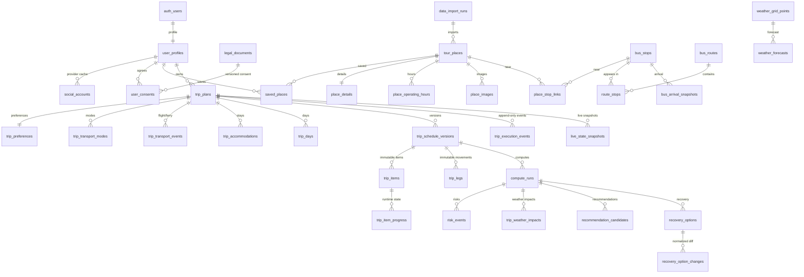
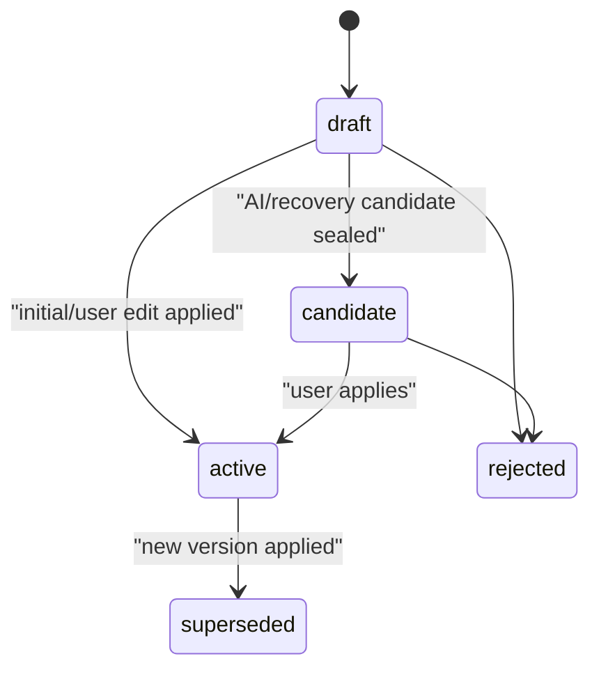

# 타이밍제주 RDB 설계 v1.1

## 1. 결론

- 하나의 Supabase Postgres/PostGIS를 사용한다.
- `auth.users`는 Supabase Auth가 소유한다.
- 앱 데이터의 유일한 writer는 Spring Boot다.
- FastAPI MCP는 DB에 직접 연결하지 않고 계산 결과 JSON만 반환한다.
- 외부 원천, 사용자 입력, 일정 버전, 계산 결과, 라이브 실행 상태를 분리한다.
- public 앱 테이블은 46개이며 모두 RLS를 활성화한다.

실행 파일:

- [확장 모듈](/Users/josephuk77/Tour-API/db/init/001_extensions.sql)
- [실행 스키마](/Users/josephuk77/Tour-API/db/init/002_schema.sql)
- [검증 시드](/Users/josephuk77/Tour-API/db/init/003_seed_fixtures.sql)
- [자동 스모크 검사](/Users/josephuk77/Tour-API/db/queries/smoke_check.sql)
- [dbdiagram.io DBML](/Users/josephuk77/Tour-API/docs/designs/timing-jeju-dbdiagram.dbml)

## 2. 소유권

| 영역 | API 소유자 | DB writer | FastAPI 역할 |
| --- | --- | --- | --- |
| Auth | Supabase Auth | Supabase Auth | 없음 |
| Profile/약관 | Spring | Spring | 없음 |
| 장소 | Spring | Spring sync/admin | 후보 facts 소비 |
| 버스/이동 | Spring | Spring cache/sync | 시간/경로 facts 소비 |
| 날씨 | Spring | Spring cache | 영향 계산 |
| 여행 입력 | Spring | Spring | 생성/계산 facts 소비 |
| 일정 버전 | Spring | Spring transaction | 후보 일정 JSON 생성 |
| 계산 결과 | Spring REST | Spring | 결과 JSON 생성 |
| 라이브 진행 | Spring | Spring | 다음 행동/재계산 |
| MCP 로그 | Spring | Spring | 응답 metadata 제공 |

FastAPI 결과도 Spring이 검증 후 저장하므로 DB connection string과 service role key를 FastAPI에 제공하지 않는다.

## 3. 도메인 관계



## 4. 테이블 사전

### 4.1 Import/Auth/Legal

| 테이블 | 의미 | Writer | 주요 제약 |
| --- | --- | --- | --- |
| `data_import_runs` | 외부 API/fixture 적재 이력 | Spring batch | source/data version/status |
| `auth.users` | 인증 원본 | Supabase Auth | 앱 migration 소유 아님 |
| `app_sessions` | 비회원/데모/공유 세션 | Spring | public token unique |
| `user_profiles` | 앱 프로필 | Spring | `auth.users`와 1:1 |
| `social_accounts` | provider 프로필 캐시 | Spring/Auth hook | provider token 저장 금지 |
| `legal_documents` | 약관 버전 | Admin/Spring | type+version unique |
| `user_consents` | 사용자별 약관 동의 | Spring | user+document unique |

소셜 provider는 `kakao`, `naver`, `google`이다. 이메일/비밀번호 사용자는 `social_accounts` 행이 없어도 정상이다.

### 4.2 Places

| 테이블 | 의미 | 원천 |
| --- | --- | --- |
| `tour_places` | 장소 read model/좌표 | TourAPI, admin upload |
| `place_details` | 전화/홈페이지/이용정보 text | TourAPI detail |
| `place_operating_hours` | 파싱/검수된 요일별 운영시간 | source/parsed/manual |
| `place_aliases` | 검색/장소명 매칭 별칭 | TourAPI, app |
| `place_images` | 장소 이미지 목록 | TourAPI/admin |
| `saved_places` | 관심 장소/메모/태그 | user input |

`recommended_stay_minutes`는 TourAPI 원천값이 아니다. 큐레이션 또는 계산 결과이며 장소 row에 앱 기준값으로 저장한다.

### 4.3 Transit/Mobility

| 테이블 | 의미 | 원천/주의 |
| --- | --- | --- |
| `bus_stops` | 정류장 기준정보 | TAGO |
| `place_stop_links` | 장소-정류장 거리/도보 연결 cache | PostGIS/route provider |
| `bus_routes` | 노선 기준정보 | TAGO |
| `route_stops` | 노선 방향별 정류장 순서 | TAGO |
| `timetable_entries` | 확보된 정적 시간표 | 보조 source; TAGO 보장 아님 |
| `bus_arrival_snapshots` | 정류장별 실시간 도착 snapshot | TAGO, 짧은 TTL |
| `mobility_route_snapshots` | 도보/대중교통/차량/택시 경로 cache | TMAP 등 provider |

`trip_legs`에는 확정 일정 버전의 이동 구간만 저장한다. 원천 route cache는 `mobility_route_snapshots`에 분리한다.

### 4.4 Weather

| 테이블 | 의미 | 원천 |
| --- | --- | --- |
| `weather_grid_points` | 위경도와 KMA `nx`,`ny` 매핑 | app/KMA grid |
| `weather_observations` | 초단기실황 snapshot | KMA |
| `weather_forecasts` | 초단기/단기예보 snapshot | KMA |
| `trip_weather_impacts` | 특정 일정 버전에 대한 날씨 영향 | FastAPI computed |

예보와 영향은 반드시 분리한다. 예보가 갱신되어도 과거 계산이 어떤 forecast를 사용했는지 FK로 추적한다.

### 4.5 Trip Input

| 테이블 | 의미 | 주요 기능 |
| --- | --- | --- |
| `trip_plans` | 여행 aggregate root | 날짜/상태/active version |
| `trip_preferences` | 지역/카테고리/시작·종료 장소 | 구조화 입력 |
| `trip_transport_modes` | 주 교통수단 1~3순위 | public transit/rental/taxi |
| `trip_place_preferences` | 필수/회피 장소 | saved place -> trip |
| `trip_transport_events` | 항공/선박 도착·출발 | flight/ferry |
| `trip_accommodations` | 복수 숙소 | 날짜순 sequence |
| `trip_days` | 날짜별 일정 컨테이너 | Day 1..N |

교통 이벤트는 arrival/departure를 각각 최대 한 건 갖는다. 숙소는 `[check_in_date, check_out_date)` 범위가 같은 여행에서 겹치지 않는다.

### 4.6 Schedule/Generation

| 테이블 | 의미 | Writer/상태 |
| --- | --- | --- |
| `trip_schedule_versions` | 일정 스냅샷 header | draft -> candidate/active |
| `trip_items` | 장소 체류/식사/숙소/도착/출발 | draft에서만 변경 가능 |
| `trip_legs` | 항목 사이 이동 구간 | draft에서만 변경 가능 |
| `itinerary_generation_runs` | 비동기 Day 생성 실행 | Spring orchestration |
| `itinerary_generation_candidates` | 실행별 후보 버전 순위 | Spring persists MCP output |
| `ai_conversations` | Phase 2 대화 | Spring |
| `ai_messages` | Phase 2 메시지 | Spring |

`trip_items.sequence_no` unique 범위는 `(schedule_version_id, trip_day_id)`다. Day 1과 Day 2에서 모두 sequence 1을 사용할 수 있다.

`trip_legs`는 이동만 표현한다. 체류를 `stay` leg로 저장하지 않는다.

`candidate` 또는 `active`로 봉인할 때 DB 함수 `assert_schedule_version_sealable`이 모든 항목의 장소/좌표, 시작·종료, 체류시간 일치, Day별 연속 순번, 시간 비중첩, 인접 항목마다 하나의 완전한 leg가 있는지 검사한다. leg는 출발·도착 시간차, `duration_minutes`, 도보·대기·탑승·환승 합계가 일치해야 한다. 관심 장소처럼 시간 없는 데이터는 `saved_places`에 둘 수 있지만 일정 버전으로는 봉인할 수 없다.

### 4.7 Compute/Recovery

| 테이블 | 의미 | 결과 생성 |
| --- | --- | --- |
| `compute_runs` | 계산 실행 header/input hash | FastAPI, Spring 저장 |
| `risk_events` | 항목/구간 위험 근거 | FastAPI |
| `trip_weather_impacts` | 항목/구간 날씨 영향 | FastAPI |
| `recommendation_candidates` | 빈 시간/주변/대체 추천 | FastAPI |
| `recovery_options` | base/proposed 버전 연결 | FastAPI |
| `recovery_option_changes` | 화면 비교용 정규화 diff | FastAPI |

모든 결과는 `schedule_version_id`, `contract_version`, `algorithm_version`, `facts_snapshot_at`로 재현할 수 있다.

자동 복구는 같은 Day에 남는 항목의 상대 순서를 보존한다. `move_day`, 대체/제외, 체류시간 단축, 교통수단 변경은 허용하지만 `reorder`는 `recovery_options.option_type`과 `recovery_option_changes.action`의 허용값에서 제외한다. 사용자의 직접 순서 변경은 일반 일정 수정 API로 새 버전을 만든다.

### 4.8 Live/Audit

| 테이블 | 의미 | 정책 |
| --- | --- | --- |
| `trip_item_progress` | 활성 버전 항목별 현재 진행상태 | 허용된 단방향 transition |
| `trip_execution_events` | 도착/완료/놓침 등 실행 이력 | append-only, client event id unique |
| `live_state_snapshots` | 시점별 상태/다음 행동 | append-only snapshot |
| `mcp_compute_call_logs` | MCP 요청/응답 감사 | redacted payload only |

계획인 `trip_items`와 실행인 `trip_item_progress`를 분리하므로 도착 처리 때문에 일정 버전이 변하지 않는다.

## 5. 일정 버전 상태 머신



허용하지 않는 역방향 전이는 DB trigger가 차단한다.

### 활성 버전 적용 트랜잭션

1. 여행 row를 잠그고 `expectedActiveScheduleVersionId`를 확인한다.
2. 기존 active를 `superseded`로 바꾼다.
3. draft/candidate를 `active`로 바꾼다.
4. `trip_plans.active_schedule_version_id`를 변경한다.
5. deferred consistency trigger가 정확히 하나의 active인지 검사한다.

커밋 중 하나라도 실패하면 기존 일정이 그대로 유지된다.

## 6. DB 강제 규칙

| 규칙 | 구현 |
| --- | --- |
| active pointer와 active status 일치 | deferred constraint trigger |
| planned/live/completed 여행은 active 필수 | deferred constraint trigger |
| 봉인된 버전 항목/구간 수정 금지 | draft-only mutation trigger |
| 불완전한 일정 candidate/active 봉인 금지 | sealability function + status trigger |
| 일정 버전 허용 상태 전이 | version mutation trigger |
| 다른 여행의 version/item/run 참조 금지 | composite FK |
| leg endpoints가 같은 Day/version | 4-column composite FK |
| Day 날짜가 `startDate + dayNo - 1` | calendar trigger |
| 이벤트/숙소가 여행 날짜 범위 안 | calendar trigger |
| 숙소 날짜 겹침 금지 | GiST exclusion constraint |
| 일정 시간은 해당 Day 안 | timeline trigger |
| 항목 진행상태 역행 금지 | progress transition trigger |
| 실행 이벤트 수정/삭제 금지 | append-only trigger |
| 같은 live event 재처리 방지 | `(trip_plan_id, client_event_id)` unique |
| 외부 원천 중복 방지 | content/node/route/grid unique |
| 위치 검색 성능 | PostGIS GiST index |
| FK cascade 성능 | 모든 FK leading index 검사 |

## 7. RLS와 Data API

### 운영 원칙

- 프런트는 Supabase Data API로 앱 테이블을 직접 읽거나 쓰지 않는다.
- 프런트는 Supabase Auth만 직접 사용하고 앱 데이터는 Spring `/api/v1/**`로 접근한다.
- `anon`, `authenticated`의 public table/sequence grant는 revoke한다.
- Spring은 서버 전용 DB role 또는 service role로 접근한다.
- 모든 public 앱 테이블에 RLS를 켜 defense-in-depth를 유지한다.
- 사용자 소유 테이블에는 owner `SELECT` policy만 정의하고 client write policy는 두지 않는다.

현재는 grant가 없으므로 owner SELECT policy가 있어도 Data API로 읽을 수 없다. 향후 특정 read model만 직접 공개할 때 grant와 policy를 함께 검토한다.

### 소유권 정책 범위

- 직접 소유: `user_profiles`, `user_consents`, `saved_places`, `trip_plans`.
- 여행 하위: preferences, modes, place preferences, events, accommodations, days, versions, items, legs.
- 실행/계산: generation runs, compute runs, risks, impacts, recommendations, recovery, progress, live snapshots.
- Phase 2: conversations/messages.

## 8. 인덱스

- 장소/정류장/현재 위치: GiST geography.
- 장소 검색: normalized name, category+region.
- 외부 snapshot: key+observed/valid/expiry.
- 여행 목록: user/session + created time.
- 일정 조회: plan+version, day+version+sequence.
- 비동기 run: trip/day + status/created.
- 위험/추천: version+severity/score.
- 라이브: trip+observed time, progress status.
- FK 인덱스: `smoke_check.sql`이 모든 FK column prefix를 검사한다.

검색 규모가 커지면 `pg_trgm`과 `GIN(normalized_name gin_trgm_ops)`를 migration으로 추가한다. 현재 fixture 단계에서는 불필요한 extension을 늘리지 않았다.

## 9. 외부값과 앱값 구분

| Field | Source |
| --- | --- |
| place content/address/location/image | TourAPI |
| stop/route/arrival | TAGO |
| mobility distance/duration/fare | TMAP 등 route provider |
| weather observation/forecast | KMA |
| saved/memo/required/pace | user input |
| recommended stay | curated/computed |
| schedule candidate | FastAPI MCP computed |
| risk/score/recommendation/recovery | FastAPI MCP computed |
| explanation | AI generated/template |

## 10. 삭제와 보존

- 사용자 탈퇴는 Supabase Auth 삭제와 앱 aggregate 삭제를 Spring job으로 조정한다.
- `trip_execution_events`, `mcp_compute_call_logs`는 운영 보존 기간과 개인정보 정책을 별도로 정한다.
- 위치 원문은 최소화하고 필요하면 격자화한다.
- 외부 snapshot은 TTL이 지나도 계산 재현 기간 동안 보존한 뒤 partition/retention job으로 정리한다.
- 장소/노선 기준정보는 hard delete보다 `stale` 표시 후 재검증한다.

## 11. 데이터 초기화

테이블은 유지하고 앱 데이터만 비울 때는 Supabase SQL Editor에서 명시적 `TRUNCATE ... RESTART IDENTITY CASCADE` migration을 실행한다. 운영 프로젝트에서는 실행 전 backup과 대상 schema 확인이 필수다.

`auth.users`를 유지하면서 `user_profiles`를 지우면 프로필이 없는 인증 사용자가 생기므로 두 영역은 별도 정책으로 처리한다.

- 테스트 데이터만 초기화: public 앱 테이블 truncate 후 seed 재실행.
- 사용자까지 초기화: Supabase Auth Admin API/Dashboard로 Auth 사용자를 먼저 정리하고 public 앱 데이터를 정리.
- migration/schema/RLS/function/trigger는 truncate로 삭제되지 않는다.

## 12. 검증 결과

검증 환경:

- PostgreSQL 16
- PostGIS 3.4
- `pgcrypto`, `postgis`, `btree_gist`
- 독립 검증 DB에서 extensions -> schema -> seed -> smoke 순서 실행

검증 fixture:

```json
{
  "trips": 1,
  "days": 3,
  "scheduleVersions": 3,
  "items": 27,
  "legs": 18,
  "accommodations": 2,
  "progressRows": 9,
  "executionEvents": 1,
  "computeRuns": 2,
  "recoveryOptions": 1
}
```

자동 확인:

- 46개 public 앱 테이블 존재/RLS 활성.
- 모든 FK leading index 존재.
- 날짜별 sequence 1 재사용 가능.
- AI 후보가 적용 가능한 전체 일정 버전임.
- active/AI/복구 후보 3개 모두 모든 인접 항목을 연결하는 leg를 가짐.
- 항목이 없거나 위치/시간/체류/leg가 불완전한 draft의 candidate 봉인이 차단됨.
- 출발·도착 시간차와 구성 시간 합계가 다른 leg의 candidate 봉인이 차단됨.
- 복구안이 base/proposed 버전과 normalized `move_day` diff를 가짐.
- 복구 enum에서 자동 `reorder`가 제외됨.
- active pointer/status 일치.
- PostGIS nearest stop 검색 동작.
- 숙소 중복 방지, 일정 불변성, 실행 이벤트 append-only trigger 존재.

## 13. 남은 운영 POC

- Supabase 실제 프로젝트에서 migration role/extension 권한 확인.
- Supabase JWT issuer/audience와 Spring Security 검증.
- Naver custom OAuth 또는 선택 provider 설정 검증.
- TourAPI `KorService2` 실제 key/operation 호출.
- TAGO 제주 도시코드와 정류장/노선/도착 join 품질.
- TMAP 대중교통/자동차/도보 제주 경로와 쿼터/약관.
- KMA 격자 변환과 발표시각 fallback golden test.
