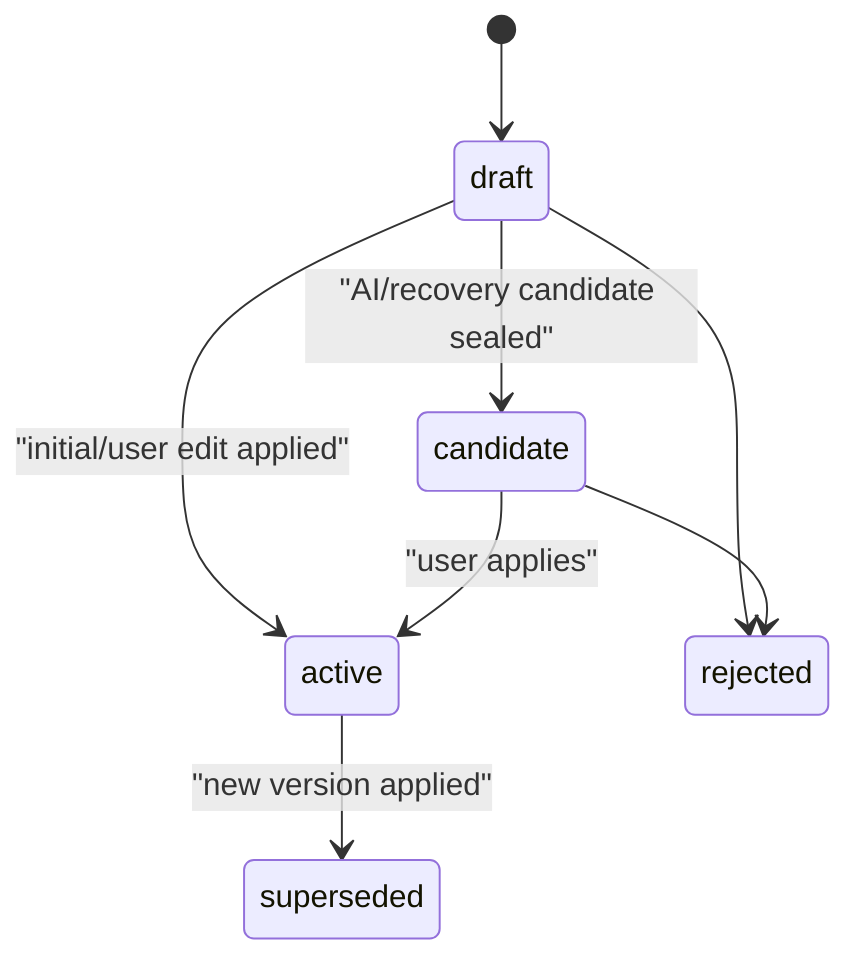

# 타이밍제주 RDB 설계 v1.2

## 1. 결론

- 하나의 Supabase Postgres/PostGIS를 사용한다.
- `auth.users`는 Supabase Auth가 소유한다.
- 앱 데이터의 유일한 writer는 Spring Boot다.
- FastAPI MCP는 DB에 직접 연결하지 않고 계산 결과 JSON만 반환한다.
- 외부 원천, 사용자 입력, 일정 버전, 계산 결과, 라이브 실행 상태를 분리한다.
- 외부 API 응답은 원문 snapshot으로 먼저 보존하고 검증·파싱한 값만 정규화 read model에 반영한다.
- public 앱 테이블은 51개이며 모두 RLS를 활성화한다.
- 이번 변경은 DB 적재 기반만 정의한다. 실제 Spring importer 구현과 스케줄링은 별도 GitHub Issue에서 진행한다.

실행 파일:

- [최초 public 스키마](../../supabase/migrations/20260728000000_initial_public_schema.sql)
- [데이터 무결성 강화](../../supabase/migrations/20260730000000_database_integrity_hardening.sql)
- [외부 적재 기반](../../supabase/migrations/20260730010000_external_ingestion_foundation.sql)
- [외부 적재 계보·유효기간 강화](../../supabase/migrations/20260730020000_ingestion_consistency_hardening.sql)
- [일정 Day 무결성 강화](../../supabase/migrations/20260730030000_schedule_consistency_hardening.sql)
- [import run 계보 보존](../../supabase/migrations/20260730040000_import_run_lineage_retention.sql)
- [스키마 계약 검사](../../db/queries/schema_contract.sql)
- [음수 무결성 계약](../../db/queries/database_negative_constraints.sql)
- [자동 스모크 검사](../../db/queries/smoke_check.sql)
- [dbdiagram.io DBML](timing-jeju-dbdiagram.dbml)

## 2. 소유권

| 영역 | API 소유자 | DB writer | FastAPI 역할 |
| --- | --- | --- | --- |
| Auth | Supabase Auth | Supabase Auth | 없음 |
| Profile/약관 | Spring | Spring | 없음 |
| 장소 | Spring | Spring sync/admin | 후보 facts 소비 |
| 버스/이동 | Spring | Spring cache/sync | 시간/경로 facts 소비 |
| 날씨 | Spring | Spring cache | 영향 계산 |
| 여행 입력 | Spring | Spring | 생성/계산 facts 소비 |
| 일정 버전 | Spring | Spring transaction | 후보 일정 JSON 생성 |
| 계산 결과 | Spring REST | Spring | 결과 JSON 생성 |
| 라이브 진행 | Spring | Spring | 다음 행동/재계산 |
| MCP 로그 | Spring | Spring | 응답 metadata 제공 |

FastAPI 결과도 Spring이 검증 후 저장하므로 DB connection string과 service role key를 FastAPI에 제공하지 않는다.

## 3. 도메인 관계

외부 데이터는 다음 순서를 건너뛰지 않는다.

```text
외부 API raw 응답
  -> data_import_runs 실행 기록
  -> external_api_snapshots 원문·요청 hash·parser version 보존
  -> 검증 및 파싱
  -> 장소·교통·날씨 정규화 read model
```

외부 정규화 행은 `import_run_id`와 `source_snapshot_id`로 실행과 원문 snapshot을 함께 가리켜야 한다. DB constraint trigger가 run·snapshot과 provider·service·operation 범위를 일치시키며 `parsed` 또는 삭제 사실을 정상 파싱한 `tombstoned` snapshot만 허용한다. 같은 snapshot/run으로는 내용이 같은 멱등 upsert만 허용하고, 내용 변경은 새 snapshot과 그 snapshot의 matching run을 연결해야 한다. `received`·`rejected`·`ignored` 원문은 반영하지 않는다. `manual`·`fixture`·`admin_upload`는 snapshot 필수성의 명시적 예외이며 이전·새 행이 모두 예외일 때 편집할 수 있다. 외부 lineage 없는 legacy 행과 snapshot-backed 외부 행 모두 marker를 예외 값으로 바꾸면서 lineage를 제거할 수 없다. marker가 이미 예외 값이어도 OLD snapshot과 run의 실제 `source_kind`·provider가 외부이면 살아 있는 snapshot과 run 계보를 제거할 수 없다. 유효한 새 snapshot과 matching run을 동시에 연결하는 정상 재수집 repair/upsert는 허용한다. retention으로 snapshot을 삭제하면 정규화 내용과 run은 유지하고 `source_snapshot_id`만 NULL로 만들며, 새 원문 repair 전에는 내용과 마지막 run을 바꿀 수 없다. `data_import_runs`는 외부·fixture·admin origin을 모두 보존하는 provenance ledger이므로 16개 정규화 테이블 중 하나라도 run을 참조하면 snapshot 유무와 origin에 관계없이 부모 DELETE를 `23503`으로 거부하고 미참조 succeeded·failed·fixture·admin run만 삭제할 수 있다. catalog audit는 정확한 16개 table/column FK mapping을 보장한다. 8개 `NO ACTION`과 8개 `SET NULL`은 유지하되 부모의 `BEFORE DELETE` guard가 FK action보다 먼저 live reference를 검사하므로 정책은 `confdeltype`에 의존하지 않는다. 기존 non-NULL lineage와 snapshot-backed optional marker 불일치도 16개 정규화 테이블에서 실제 run origin까지 소급 감사한다.

```mermaid
erDiagram
  auth_users ||--|| user_profiles : "profile"
  user_profiles ||--o{ social_accounts : "provider cache"
  user_profiles ||--o{ user_consents : "agrees"
  legal_documents ||--o{ user_consents : "versioned consent"
  user_profiles ||--o{ saved_places : "saves"
  tour_places ||--o{ saved_places : "saved"

  data_import_runs ||--o{ data_import_checkpoints : "last success"
  data_import_runs ||--o{ external_api_snapshots : "captures raw"
  external_api_snapshots ||--o{ tour_place_sources : "lineage"
  external_api_snapshots ||--o{ place_detail_items : "lineage"
  external_api_snapshots ||--o{ tour_api_detail_item_sweep_pages : "ordered raw pages"
  tour_api_detail_item_sweeps ||--|{ tour_api_detail_item_sweep_pages : "complete manifest"
  tour_api_detail_item_sweeps ||--o{ place_detail_items : "accepted sweep"
  external_api_snapshots ||--o{ tour_api_place_image_sweep_pages : "ordered image pages"
  tour_api_place_image_sweeps ||--|{ tour_api_place_image_sweep_pages : "complete image manifest"
  tour_api_place_image_sweeps ||--o{ place_images : "accepted image sweep"
  external_api_snapshots ||--o{ external_reference_codes : "lineage"
  data_import_runs ||--o{ tour_places : "normalizes"
  external_api_snapshots ||--o{ tour_places : "source snapshot"
  tour_places ||--|| place_details : "details"
  tour_places ||--o{ tour_place_sources : "provider identities"
  tour_places ||--o{ place_detail_items : "repeated details"
  tour_places ||--o{ place_operating_hours : "hours"
  tour_places ||--o{ place_images : "images"
  tour_places ||--o{ place_stop_links : "near"
  bus_stops ||--o{ place_stop_links : "near"
  bus_routes ||--o{ route_stops : "contains"
  bus_stops ||--o{ route_stops : "appears in"
  bus_stops ||--o{ bus_arrival_snapshots : "arrival"
  weather_grid_points ||--o{ weather_forecasts : "forecast"

  user_profiles ||--o{ trip_plans : "owns"
  trip_plans ||--|| trip_preferences : "preferences"
  trip_plans ||--o{ trip_transport_modes : "modes"
  trip_plans ||--o{ trip_transport_events : "flight/ferry"
  trip_plans ||--o{ trip_accommodations : "stays"
  trip_plans ||--o{ trip_days : "days"
  trip_plans ||--o{ trip_schedule_versions : "versions"
  trip_schedule_versions ||--o{ trip_items : "immutable items"
  trip_schedule_versions ||--o{ trip_legs : "immutable movements"
  trip_items ||--o{ trip_item_progress : "runtime state"
  trip_plans ||--o{ trip_execution_events : "append-only events"

  trip_schedule_versions ||--o{ compute_runs : "computes"
  compute_runs ||--o{ risk_events : "risks"
  compute_runs ||--o{ trip_weather_impacts : "weather impacts"
  compute_runs ||--o{ recommendation_candidates : "recommendations"
  compute_runs ||--o{ recovery_options : "recovery"
  recovery_options ||--o{ recovery_option_changes : "normalized diff"
  trip_plans ||--o{ live_state_snapshots : "live snapshots"
```



## 4. 테이블 사전

### 4.1 Import/원천/Auth/Legal

| 테이블 | 의미 | Writer | 주요 제약 |
| --- | --- | --- | --- |
| `data_import_runs` | 외부 API/fixture 적재 실행 | Spring batch | provider·service·operation·scope, parser/schema version, sync mode, 멱등 키, parent/retry, 전후 checkpoint와 처리 건수, legacy 격리 marker |
| `data_import_checkpoints` | 공급자·서비스·operation·scope별 마지막 성공 지점 | Spring batch | 같은 범위 unique, CAS `version`, 같은 범위의 `succeeded` run만 참조, reset 금지 |
| `external_api_snapshots` | redaction된 요청 메타데이터와 원문 응답 snapshot | Spring batch | run/source scope와 요청·payload 감사 필드 불변, 요청/payload SHA-256와 parse 상태 |
| `external_reference_codes` | 지역·분류·도시 등 외부 코드의 유효기간별 사전 | Spring batch | provider/service/type/code별 유효기간 중복 금지, snapshot lineage |
| `auth.users` | 인증 원본 | Supabase Auth | 앱 migration 소유 아님 |
| `app_sessions` | 비회원/데모/공유 세션 | Spring | public token unique |
| `user_profiles` | 앱 프로필 | Spring | `auth.users`와 1:1 |
| `social_accounts` | provider 프로필 캐시 | Spring/Auth hook | provider token 저장 금지 |
| `legal_documents` | 약관 버전 | Admin/Spring | type+version unique |
| `user_consents` | 사용자별 약관 동의 | Spring | user+document unique |

소셜 provider는 `kakao`, `naver`, `google`이다. 이메일/비밀번호 사용자는 `social_accounts` 행이 없어도 정상이다.

`data_import_runs.status`는 `running`, `succeeded`, `failed`, `partial`, `cancelled`를 구분하고 성공/실패 종료 시각과 오류 필드 조합을 DB가 검사한다. run의 `source_kind`·provider·service·operation·scope는 생성 후 불변이다. 동일 provider/service/operation/scope의 실행 중 run은 하나만 허용하며, `idempotency_key`가 있으면 같은 범위에서 중복 실행을 막는다. 정상 신규 행은 `running_scope_enforced`와 `idempotency_enforced`가 항상 `true`다. 멱등 중복은 `(started_at, id)` 기준 첫 행만 `idempotency_enforced=true` canonical arbiter로 남고, grandfathered 동생이 있으면 선삭제할 수 없다. 이 marker 조건 partial unique index만 신규 importer의 `ON CONFLICT` 기준이다. 실행 중 중복도 첫 행만 `running_scope_enforced=true`지만 후속 `false` 행이 남은 범위에 새 run을 쓰면 BEFORE trigger가 직접 `23505`로 거부하며 canonical 삭제 보호나 `ON CONFLICT` 의미는 없다. 길이와 충돌을 해소한 legacy 행만 각 marker를 true로 올려 복구한다. 모든 origin의 run 삭제 전에는 16개 정규화 run FK를 검사하고 하나라도 참조하면 `23503`으로 중단한다.

한 run에 연결된 모든 `external_api_snapshots`는 정확히 하나의 provider·service·operation·scope를 공유한다. legacy 다중 범위 실행은 run ID와 충돌 범위를 출력하고 마이그레이션을 중단하며, 운영자가 snapshot을 범위별 별도 run으로 분리하거나 격리한 뒤 재적용한다. 기준 코드·시간표·같은 요일 open/closed 영업시간의 legacy 유효기간 중복도 exclusion 설치 전 pair audit에서 정확한 두 행 ID로 중단한다. 자동 삭제나 임의 병합은 하지 않는다.

`data_import_checkpoints`는 같은 범위의 `succeeded` run만 참조하며 `advance_data_import_checkpoint(...)`의 기대 version CAS로만 한 단계 전진한다. stale writer는 `40001`, 이전 run 역행과 source scope 변경은 실패하고 DELETE·TRUNCATE도 금지한다. `anon`·`authenticated`는 함수를 실행할 수 없으며 `service_role`도 테이블 직접 UPDATE 대신 이 함수만 호출한다.

`external_api_snapshots.raw_payload`에는 API key, Authorization 헤더, 원문 요청 URL과 PII를 저장하지 않는다. source identity뿐 아니라 request hash, parser version, payload hash와 raw payload 같은 감사 필드는 생성 후 바꿀 수 없고 `parsed`/`tombstoned` 상태를 미파싱 상태로 되돌릴 수 없다. 공개 API와 계산 계층은 이 테이블을 직접 읽지 않는다. 수집 내부 테이블 5개는 RLS를 켜되 `anon`·`authenticated` policy와 직접 grant를 두지 않는다.

`service_role`은 필요한 앱 DML과 허용된 RPC만 사용하며, 행 trigger를 우회하는 `TRUNCATE` 권한은 기존·향후 public 앱 테이블에서 제거한다. `spatial_ref_sys` 같은 확장 관리 객체는 확장 소유자의 ACL 경계이므로 앱 테이블 권한 검사에서 제외한다. 파괴적 앱 테이블 초기화는 통제된 migration owner 경로로 제한한다.

### 4.2 Places

| 테이블 | 의미 | 원천 |
| --- | --- | --- |
| `tour_places` | 장소 read model/좌표 | TourAPI, admin upload |
| `tour_place_sources` | 한 장소에 연결된 provider/service별 외부 식별자와 삭제·stale 상태 | TourAPI, admin upload |
| `place_details` | 전화/홈페이지/이용정보 text | TourAPI detail |
| `place_detail_items` | `detailInfo2`의 반복·부가 항목 | TourAPI detail, item type/source key별 upsert |
| `tour_api_detail_item_sweeps` | 완전한 `detailInfo2` 수집 manifest와 scope watermark | TourAPI detail complete sweep |
| `tour_api_detail_item_sweep_pages` | sweep의 순서 있는 raw page snapshot 계보 | TourAPI detail page snapshot |
| `place_operating_hours` | 파싱/검수된 요일별 반복 운영시간 | source/parsed/manual |
| `place_aliases` | 검색/장소명 매칭 별칭 | TourAPI, app |
| `place_images` | 외부 이미지 ID·저작권·출처를 보존한 반복 이미지 목록 | TourAPI/admin |
| `saved_places` | 관심 장소/메모/태그 | user input |

`recommended_stay_minutes`는 TourAPI 원천값이 아니다. 큐레이션 또는 계산 결과이며 장소 row에 앱 기준값으로 저장한다.

`tour_places`는 앱의 통합 장소 read model이고 외부 natural key는 `tour_place_sources`의 `(source_provider, source_service, external_id)`가 소유한다. TourAPI KorService2의 최신 법정동·분류 원문은 `l_dong_regn_cd`, `l_dong_signgu_cd`, `lcls_systm1`, `lcls_systm2`, `lcls_systm3`에 보존하며 기존 컬럼은 legacy 호환 필드다. `place_detail_items`는 provider/service/item key로 멱등 upsert한다. 영업시간은 같은 요일뿐 아니라 익일 첫 구간·휴무와도 겹칠 수 없고 정확히 `00:00`에 끝나는 구간은 다음 날을 점유하지 않는다. 교차 요일 검사는 같은 장소 행에 MVCC 쓰기 펜스를 세워 직렬화하고 오래된 `REPEATABLE READ` writer는 `40001`로 중단한다. 충돌하는 legacy 조합은 자동 수정하지 않고 migration을 중단한다. 신규 이미지와 URL 변경은 trigger가 길이 prefix를 포함한 `(place_id, source_provider, source_service, image_url)`의 SHA-256 digest를 `source_url_key`로 계산한다. declarative unique `(place_id, source_url_key)`가 `ON CONFLICT` 기준이며 advisory lock과 원본 비교가 digest collision을 차단한다. `source_image_id`가 있으면 별도 unique도 적용하고, v1의 기존 중복 URL만 `source_url_key=NULL`로 보존한다.

`detailInfo2` item은 composite FK `(source_sweep_id, source_snapshot_id)`로 실제 포함된 sweep page pair를 참조한다. nullable legacy row는 호환하되 신규 insert/update 및 stale/tombstone lifecycle은 일치하는 pair만 허용한다. sweep은 ordered page snapshot ID·request fingerprint·payload hash·raw count manifest를 보존하고 normalized row와 독립적인 scope watermark 역할을 하므로 complete empty도 최신성 근거로 남는다. 같은 content advisory lock transaction에서 sweep 수용과 item/lifecycle write를 함께 수행하며 incomplete sweep은 watermark를 전진시키지 않는다.

### 4.3 Transit/Mobility

| 테이블 | 의미 | 원천/주의 |
| --- | --- | --- |
| `bus_stops` | 정류장 기준정보 | TAGO |
| `place_stop_links` | 장소-정류장 거리/도보 연결 cache | PostGIS/route provider |
| `bus_routes` | 노선 기준정보 | TAGO |
| `route_stops` | 노선 방향별 정류장 순서 | TAGO |
| `timetable_entries` | 확보된 정적 시간표 | 보조 source; TAGO 보장 아님 |
| `bus_arrival_snapshots` | 정류장별 실시간 도착 snapshot | TAGO, 짧은 TTL |
| `mobility_route_snapshots` | 도보/대중교통/차량/택시 경로 cache | TMAP 등 provider |

`trip_legs`에는 확정 일정 버전의 이동 구간만 저장한다. 원천 route cache는 `mobility_route_snapshots`에 분리한다.

TAGO의 `node_id`, `external_stop_id`, `external_route_id`는 전역 키로 취급하지 않는다. 정류장과 노선은 provider/service/city 범위로 식별한다. `route_stops`도 provider와 city를 소유해 다른 공급자·도시의 노선과 정류장을 섞지 못한다. UUID FK는 route/stop 존재와 삭제 전파를 담당하고, source scope trigger가 route·stop·route_stop의 provider/city 조합을 잠금과 함께 정확히 검증한다. `timetable_entries.city_code`는 legacy의 경유지 누락·provider 불일치 행을 보존하기 위해 물리적으로 nullable이다. 신규·관련 컬럼 변경에는 trigger가 non-null provider/city와 동일 route/direction/stop/provider/city의 유효한 route_stop을 요구한다. lineage 없는 legacy 행은 그대로 변경할 수 없지만 `parsed`/`tombstoned` snapshot과 일치 run을 함께 연결해 유효 범위로 복구할 수 있다. 같은 source record의 유효기간은 GiST exclusion으로 겹칠 수 없다.

### 4.4 Weather

| 테이블 | 의미 | 원천 |
| --- | --- | --- |
| `weather_grid_points` | 위경도와 KMA `nx`,`ny` 매핑 | app/KMA grid |
| `weather_observations` | 초단기실황 snapshot | KMA |
| `weather_forecasts` | 초단기/단기예보 snapshot | KMA |
| `trip_weather_impacts` | 특정 일정 버전에 대한 날씨 영향 | FastAPI computed |

예보와 영향은 반드시 분리한다. 예보가 갱신되어도 과거 계산이 어떤 forecast를 사용했는지 FK로 추적한다.

### 4.5 Trip Input

| 테이블 | 의미 | 주요 기능 |
| --- | --- | --- |
| `trip_plans` | 여행 aggregate root | 날짜/상태/active version |
| `trip_preferences` | 지역/카테고리/시작·종료 장소 | 구조화 입력 |
| `trip_transport_modes` | 주 교통수단 1~3순위 | public transit/rental/taxi |
| `trip_place_preferences` | 필수/회피 장소 | saved place -> trip |
| `trip_transport_events` | 항공/선박 도착·출발 | flight/ferry |
| `trip_accommodations` | 복수 숙소 | 날짜순 sequence |
| `trip_days` | 날짜별 일정 컨테이너 | Day 1..N |

교통 이벤트는 arrival/departure를 각각 최대 한 건 갖는다. 숙소는 `[check_in_date, check_out_date)` 범위가 같은 여행에서 겹치지 않는다.

### 4.6 Schedule/Generation

| 테이블 | 의미 | Writer/상태 |
| --- | --- | --- |
| `trip_schedule_versions` | 일정 스냅샷 header | draft -> candidate/active |
| `trip_items` | 장소 체류/식사/숙소/도착/출발 | draft에서만 변경 가능 |
| `trip_legs` | 항목 사이 이동 구간 | draft에서만 변경 가능 |
| `itinerary_generation_runs` | 비동기 Day 생성 실행 | Spring orchestration |
| `itinerary_generation_candidates` | 실행별 후보 버전 순위 | Spring persists MCP output |
| `ai_conversations` | Phase 2 대화 | Spring |
| `ai_messages` | Phase 2 메시지 | Spring |

`trip_items.sequence_no` unique 범위는 `(schedule_version_id, trip_day_id)`다. Day 1과 Day 2에서 모두 sequence 1을 사용할 수 있다.

`trip_legs`는 이동만 표현한다. 체류를 `stay` leg로 저장하지 않는다.

일정 버전의 `version_no`는 생성 후 바꿀 수 없고 `base_schedule_version_id`는 같은 여행의 더 작은 번호만 참조한다. `candidate` 또는 `active` 봉인은 장소/좌표, 시간, Day 순번·범위, 인접 leg의 완전성을 검사한다. 봉인과 Day/여행 날짜 변경은 같은 `trip_plan` 행에 MVCC 쓰기 펜스를 세워 동시 write-skew를 차단한다. `READ COMMITTED`에서는 대기 후 최신 상태를 다시 검사하고 오래된 `REPEATABLE READ` writer는 `40001`로 중단한다. migration 당시 이미 봉인된 legacy 일정도 audit한다. 항목의 시작과 종료는 모두 같은 제주 현지 Day에 있어야 하며 leg의 시간차와 구성 시간 합계가 일치해야 한다. 관심 장소처럼 시간 없는 데이터는 `saved_places`에 둘 수 있지만 일정 버전으로는 봉인할 수 없다.

### 4.7 Compute/Recovery

| 테이블 | 의미 | 결과 생성 |
| --- | --- | --- |
| `compute_runs` | 계산 실행 header/input hash | FastAPI, Spring 저장 |
| `risk_events` | 항목/구간 위험 근거 | FastAPI |
| `trip_weather_impacts` | 항목/구간 날씨 영향 | FastAPI |
| `recommendation_candidates` | 빈 시간/주변/대체 추천 | FastAPI |
| `recovery_options` | base/proposed 버전 연결 | FastAPI |
| `recovery_option_changes` | 화면 비교용 정규화 diff | FastAPI |

모든 완료 결과는 `schedule_version_id`, `contract_version`, `algorithm_version`, `facts_snapshot_at`로 재현할 수 있다. queued run의 started/facts/source는 모두 NULL이며, claim transaction이 DB 시각과 계획의 source data version으로 세 값을 채우면서 running으로 전이한다. 공통 worker는 30초 lease, 10초 heartbeat, 증가하는 fencing token, 최대 5회 attempt와 다음 retry 시각을 `compute_runs`에 보존한다. claim·heartbeat·retry·terminal 권한은 worker JVM 시각이 아니라 PostgreSQL `statement_timestamp()`와 active lease로 판정한다. 만료된 running run은 새 token으로 재개하고 이전 token 또는 만료 token의 heartbeat·terminal 쓰기는 거부한다. 성공 상태는 `succeeded` 하나이며 executor가 전달한 `result_source`로 `computed`와 `fallback`을 구분한다.

`trip_weather_impacts`와 `recommendation_candidates.trip_day_id`는 v1의 NULL을 보존하되 신규 INSERT에는 필수이고, 한 번 채운 값을 NULL로 되돌릴 수 없다. non-null 행은 compute run과 item/leg를 4열 복합 identity로 참조해 서로 다른 Day의 계산 결과가 섞이지 않는다. legacy NULL-Day 행은 결과의 compute/item/leg 계보와 해당 부모의 Day를 함께 동결한다. 결과 Day와 같은 Day의 부모 참조를 한 번에 지정하는 명시적 repair만 허용한다.

자동 복구는 같은 Day에 남는 항목의 상대 순서를 보존한다. `move_day`, 대체/제외, 체류시간 단축, 교통수단 변경은 허용하지만 `reorder`는 `recovery_options.option_type`과 `recovery_option_changes.action`의 허용값에서 제외한다. 사용자의 직접 순서 변경은 일반 일정 수정 API로 새 버전을 만든다.

### 4.8 Live/Audit

| 테이블 | 의미 | 정책 |
| --- | --- | --- |
| `trip_item_progress` | 활성 버전 항목별 현재 진행상태 | 허용된 단방향 transition |
| `trip_execution_events` | 도착/완료/놓침 등 실행 이력 | append-only, client event id unique |
| `live_state_snapshots` | 시점별 상태/다음 행동 | append-only snapshot |
| `mcp_compute_call_logs` | MCP 요청/응답 감사 | redacted payload only |

계획인 `trip_items`와 실행인 `trip_item_progress`를 분리하므로 도착 처리 때문에 일정 버전이 변하지 않는다.

## 5. 일정 버전 상태 머신



허용하지 않는 역방향 전이는 DB trigger가 차단한다.

### 활성 버전 적용 트랜잭션

1. 여행 row를 잠그고 `expectedActiveScheduleVersionId`를 확인한다.
2. 기존 active를 `superseded`로 바꾼다.
3. draft/candidate를 `active`로 바꾼다.
4. `trip_plans.active_schedule_version_id`를 변경한다.
5. deferred consistency trigger가 정확히 하나의 active인지 검사한다.

커밋 중 하나라도 실패하면 기존 일정이 그대로 유지된다.

## 6. DB 강제 규칙

| 규칙 | 구현 |
| --- | --- |
| active pointer와 active status 일치 | deferred constraint trigger |
| planned/live/completed 여행은 active 필수 | deferred constraint trigger |
| 봉인된 버전 항목/구간 수정 금지 | draft-only mutation trigger |
| 불완전한 일정 candidate/active 봉인 금지 | sealability function + status trigger |
| 일정 버전 허용 상태 전이 | version mutation trigger |
| base 일정 계보가 같은 여행의 선행 version만 참조 | base lineage trigger |
| 다른 여행의 version/item/run 참조 금지 | composite FK |
| leg endpoints가 같은 Day/version | 4-column composite FK |
| 날씨 영향·추천의 run/item/leg가 같은 Day/version | 4-column composite FK |
| Day 날짜가 `startDate + dayNo - 1` | calendar trigger |
| candidate/active가 쓰는 Day와 여행 날짜 변경 금지 | sealed day/date protection trigger |
| 이벤트/숙소가 여행 날짜 범위 안 | calendar trigger |
| 숙소 날짜 겹침 금지 | GiST exclusion constraint |
| 일정 시간은 해당 Day 안 | timeline trigger |
| 항목 진행상태 역행 금지 | progress transition trigger |
| 실행 이벤트 수정/삭제 금지 | append-only trigger |
| 같은 live event 재처리 방지 | `(trip_plan_id, client_event_id)` unique |
| 외부 원문 중복·hash 형식 검증 | 실행/operation/request/page/payload unique와 SHA-256 형식 check |
| 한 import run의 snapshot source scope 일치·불변 | UUID FK + provider/service/operation/scope identity trigger + 다중 범위 legacy preflight |
| 원문 snapshot 감사 payload 불변·parse 역행 금지 | audit identity trigger |
| 외부 정규화 행과 parsed/tombstoned 원문 계보·내용 일치 | deferred lineage constraint trigger, 내용 변경 시 새 snapshot/run |
| checkpoint stale writer·역행·reset 차단 | service-role 전용 CAS 함수 + reset trigger |
| 기준 코드·시간표 유효기간 중복 금지 | 식별자 포함 legacy pair preflight + provider/service/scope별 GiST exclusion |
| 외부 natural key 중복 방지 | provider/service 범위 unique; TAGO 정류장·노선은 `city_code` 포함 |
| 반복 영업시간 open/closed·익일 충돌 방지 | GiST exclusion + 교차 요일 trigger/audit |
| legacy 값 보존·신규 값 엄격 적용 | `NOT VALID` constraint + 신규 write trigger |
| 노선·정류장·시간표 source scope 일치 | UUID FK + provider/city 잠금 검증 trigger; lineage 기반 legacy repair |
| 결과 Day와 compute/item/leg Day 일치 | 4열 복합 FK + legacy NULL-Day 자식·부모 동결/repair trigger |
| 위치 검색 성능 | PostGIS GiST index |
| FK cascade 성능 | 모든 FK leading index 검사 |

## 7. RLS와 Data API

### 운영 원칙

- 프런트는 Supabase Data API로 앱 테이블을 직접 읽거나 쓰지 않는다.
- 프런트는 Supabase Auth만 직접 사용하고 앱 데이터는 Spring `/api/v1/**`로 접근한다.
- `anon`, `authenticated`의 public table/sequence grant는 revoke한다.
- Spring은 서버 전용 DB role 또는 service role로 접근한다.
- 모든 public 앱 테이블에 RLS를 켜 defense-in-depth를 유지한다.
- 사용자 소유 테이블에는 owner `SELECT` policy만 정의하고 client write policy는 두지 않는다.

현재는 grant가 없으므로 owner SELECT policy가 있어도 Data API로 읽을 수 없다. 향후 특정 read model만 직접 공개할 때 grant와 policy를 함께 검토한다.

### 소유권 정책 범위

- 직접 소유: `user_profiles`, `user_consents`, `saved_places`, `trip_plans`.
- 여행 하위: preferences, modes, place preferences, events, accommodations, days, versions, items, legs.
- 실행/계산: generation runs, compute runs, risks, impacts, recommendations, recovery, progress, live snapshots.
- Phase 2: conversations/messages.

## 8. 인덱스

- 장소/정류장/현재 위치: GiST geography.
- 장소 검색: normalized name, category+region.
- 외부 원문 snapshot: provider/service/operation/scope+fetched, external record, purge 시각.
- 정규화 lineage: `source_snapshot_id`, `import_run_id` FK와 provider/service/operation 범위 복합 인덱스.
- 여행 목록: user/session + created time.
- 일정 조회: plan+version, day+version+sequence.
- 비동기 run: trip/day + status/created.
- 위험/추천: version+severity/score.
- 라이브: trip+observed time, progress status.
- FK 인덱스: `smoke_check.sql`이 모든 FK column prefix를 검사한다.

검색 규모가 커지면 `pg_trgm`과 `GIN(normalized_name gin_trgm_ops)`를 migration으로 추가한다. 현재 fixture 단계에서는 불필요한 extension을 늘리지 않았다.

## 9. 외부값과 앱값 구분

| Field | Source |
| --- | --- |
| place content/address/location/image | TourAPI |
| stop/route/arrival | TAGO |
| mobility distance/duration/fare | TMAP 등 route provider |
| weather observation/forecast | KMA |
| saved/memo/required/pace | user input |
| recommended stay | curated/computed |
| schedule candidate | FastAPI MCP computed |
| risk/score/recommendation/recovery | FastAPI MCP computed |
| explanation | AI generated/template |

외부값을 가진 정규화 행은 반드시 같은 범위의 `import_run_id`와 `source_snapshot_id`를 남긴다. 수동·fixture·admin 행만 명시적으로 예외이며, 두 ID는 서로 대체하지 않는다.

## 10. 삭제와 보존

- 사용자 탈퇴는 Supabase Auth 삭제와 앱 aggregate 삭제를 Spring job으로 조정한다.
- `trip_execution_events`, `mcp_compute_call_logs`는 운영 보존 기간과 개인정보 정책을 별도로 정한다.
- 위치 원문은 최소화하고 필요하면 격자화한다.
- `external_api_snapshots`는 계산 재현 기간 동안 보존한 뒤 `purge_after` 기준의 별도 retention job으로 정리한다. 삭제 시 정규화 내용과 import run lineage는 유지하고 snapshot 포인터만 NULL로 만들며, 새 원문을 연결하기 전에는 내용과 마지막 run을 바꾸지 않는다. 정규화 행이 run을 참조하는 동안 origin과 관계없이 provenance 부모 run은 삭제할 수 없다.
- 장소/노선 기준정보는 hard delete보다 `stale` 표시 후 재검증한다.

## 11. 데이터 초기화

로컬 전체 초기화는 `supabase db reset`으로 DB를 재생성한다. 운영에서 ingestion audit/checkpoint를 포함한 public 전체 `TRUNCATE`는 금지하며, checkpoint는 보호 trigger 때문에 DELETE·TRUNCATE할 수 없다. 업무 테이블 초기화가 필요하면 backup과 대상 목록을 검토한 별도 승인 migration으로 수집 이력 테이블을 제외해 실행한다.

`auth.users`를 유지하면서 `user_profiles`를 지우면 프로필이 없는 인증 사용자가 생기므로 두 영역은 별도 정책으로 처리한다.

- 테스트 데이터만 초기화: 로컬 `supabase db reset` 또는 격리 Docker DB 재생성.
- 사용자까지 초기화: Supabase Auth Admin API/Dashboard로 Auth 사용자를 먼저 정리하고 public 앱 데이터를 정리.
- migration/schema/RLS/function/trigger는 truncate로 삭제되지 않는다.

## 12. 검증 결과

검증 환경:

- PostgreSQL 16
- PostGIS 3.4
- `pgcrypto`, `postgis`, `btree_gist`
- 독립 검증 DB에서 extensions -> schema -> seed -> smoke 순서 실행

검증 fixture:

```json
{
  "trips": 1,
  "days": 3,
  "scheduleVersions": 3,
  "items": 27,
  "legs": 18,
  "accommodations": 2,
  "progressRows": 9,
  "executionEvents": 1,
  "computeRuns": 2,
  "recoveryOptions": 1
}
```

자동 확인:

- 51개 public 앱 테이블 존재/RLS 활성.
- 신규 수집 내부 테이블 5개에 client policy/grant가 없고 checkpoint는 `service_role`의 CAS 함수 호출만 허용함.
- `service_role`이 public 앱 테이블의 DML은 유지하되 기존·향후 앱 테이블의 `TRUNCATE`는 수행할 수 없음(확장 관리 객체 제외).
- raw snapshot에서 정규화 테이블까지 `import_run_id`/`source_snapshot_id` lineage와 provider 범위 unique/trigger가 존재하고 한 run이 정확히 한 snapshot 범위를 소유함.
- 외부 기준 코드·시간표 유효기간과 영업시간 open/closed 충돌이 식별자 포함 preflight 및 exclusion constraint로 차단됨.
- route/stop/timetable의 provider·city 범위는 UUID FK와 검증 trigger로, 계산 결과의 trip Day 범위는 4열 복합 FK와 NULL-Day 보호 trigger로 일치함.
- 모든 FK leading index 존재.
- 날짜별 sequence 1 재사용 가능.
- AI 후보가 적용 가능한 전체 일정 버전임.
- active/AI/복구 후보 3개 모두 모든 인접 항목을 연결하는 leg를 가짐.
- 항목이 없거나 위치/시간/체류/leg가 불완전한 draft의 candidate 봉인이 차단됨.
- 출발·도착 시간차와 구성 시간 합계가 다른 leg의 candidate 봉인이 차단됨.
- 선행 version이 아닌 base 계보와 봉인 후 Day/여행 날짜 변경이 차단됨.
- 복구안이 base/proposed 버전과 normalized `move_day` diff를 가짐.
- 복구 enum에서 자동 `reorder`가 제외됨.
- active pointer/status 일치.
- PostGIS nearest stop 검색 동작.
- 숙소 중복 방지, 일정 불변성, 실행 이벤트 append-only trigger 존재.

## 13. 남은 운영 POC

- Supabase 실제 프로젝트에서 migration role/extension 권한 확인.
- Supabase JWT issuer/audience와 Spring Security 검증.
- Naver custom OAuth 또는 선택 provider 설정 검증.
- TourAPI `KorService2` 실제 key/operation 호출.
- TAGO 제주 도시코드와 정류장/노선/도착 join 품질.
- TMAP 대중교통/자동차/도보 제주 경로와 쿼터/약관.
- KMA 격자 변환과 발표시각 fallback golden test.
- Spring 외부 API importer, 구현된 checkpoint CAS 함수의 호출 adapter와 retention job은 별도 GitHub Issue.
