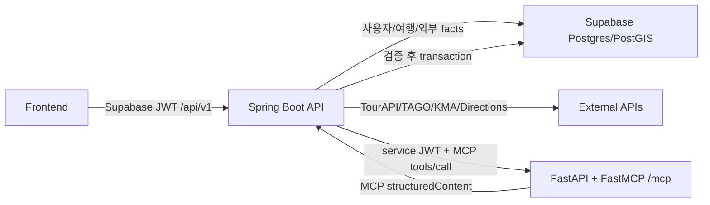
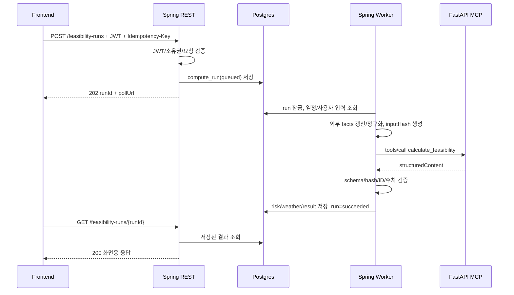

# 타이밍제주 Spring-FastAPI MCP 내부 연동 명세 v1.1

## 1. 목적과 확정 결정

이 문서는 프런트 요청을 받은 Spring Boot가 어떤 데이터를 조립해 FastAPI MCP에 보내고, 어떤 형식으로 결과를 받아 검증·저장·응답하는지 정의한다.

| 항목 | 확정값 |
| --- | --- |
| 공개 API | Spring Boot `/api/v1/**` |
| MCP 호출자 | Spring Boot worker만 허용 |
| MCP 서버 | FastAPI 서비스에 탑재한 공식 Python SDK `FastMCP` |
| 전송 | Stateless MCP Streamable HTTP |
| 내부 endpoint | `POST /mcp` |
| MCP 응답 방식 | JSON response, 계산 본문은 `result.structuredContent` |
| 인증 | private network + 짧은 수명의 내부 service JWT |
| 사용자 JWT 전달 | 금지 |
| FastAPI DB/외부 API 접근 | 금지 |
| 결과 검증/저장 | Spring Boot |

Spring에서는 프로젝트 BOM과 호환되는 `spring-ai-starter-mcp-client-webflux`를 사용한다. FastAPI 쪽은 공식 `mcp` Python SDK의 `FastMCP(stateless_http=True, json_response=True)`를 사용한다. 애플리케이션 코드가 JSON-RPC를 직접 조립하지 않고 양쪽 공식 SDK가 초기화, protocol negotiation, `tools/list`, `tools/call`을 처리한다.

## 2. 배포 경계



| 구분 | 주소 예시 | 외부 공개 |
| --- | --- | --- |
| Spring REST | `https://api.timing-jeju.example/api/v1` | 예 |
| FastAPI MCP | `http://timing-jeju-ai:8000/mcp` | 아니오 |
| FastAPI liveness | `http://timing-jeju-ai:8000/health/live` | 아니오 |
| FastAPI readiness | `http://timing-jeju-ai:8000/health/ready` | 아니오 |

FastAPI MCP에는 public ingress와 CORS를 열지 않는다. Supabase JWT, refresh token, provider token, 이메일, 닉네임은 MCP payload에 포함하지 않는다.

## 3. 비동기 실행 흐름



공개 `POST`는 FastAPI 계산 완료를 기다리지 않는다. 같은 `Idempotency-Key`로 재요청하면 기존 run을 반환한다. 계산 실패도 run 이력으로 남기며 활성 일정은 변경하지 않는다.

## 4. Spring API와 MCP Tool 매핑

| Spring 공개 API/내부 동작 | MCP Tool | Spring이 보내는 핵심 데이터 | Spring 저장 테이블 |
| --- | --- | --- | --- |
| `POST /generation-runs` | `generate_day_itinerary` | 여행 조건, 대상 Day, 필수/선택 장소, 숙소/도착출발, 이동/날씨 facts | `itinerary_generation_runs`, schedule candidate tables |
| 일정 편집 후 AI 보정 | `revise_day_itinerary` | 현재 Day 전체 일정, 사용자 수정 지시, 최신 이동/날씨 facts | 새 draft/candidate schedule version |
| 후보 봉인 전 검증 | `validate_itinerary` | 전체 일정 items/legs, 운영시간, 숙소, 도착출발 facts | 검증 실패 기록 또는 봉인 진행 |
| `POST /feasibility-runs` | `calculate_feasibility` | 일정 items/legs, 버스 도착, 이동, 날씨 facts, 위험 정책 | `compute_runs`, `risk_events`, `trip_weather_impacts` |
| `POST /spare-time-runs` | `recommend_spare_time` | 빈 시간, 기준 위치, 장소 후보, 왕복 이동/날씨 facts | `recommendation_candidates` |
| `POST /recovery-runs` | `generate_recovery_options` | active 일정 전체, 진행 상태, 위험 이벤트, 현재 위치, 최신 facts | `recovery_options`, `recovery_option_changes`, proposed version |
| `POST /live-recalculation-runs` | `recalculate_live_state` | 현재 시각/위치, 진행 상태, 다음 항목, 버스/날씨 facts | `live_state_snapshots`, risk/recovery results |
| 계산 설명 생성 | `explain_result` | Spring이 확정한 수치 결과와 reason codes | 설명 또는 fallback template |
| Phase 2 대화 입력 | `parse_trip_intent` | 메시지와 현재 구조화 조건, 허용된 place IDs | `ai_conversations`, `ai_messages`; 확인 전 trip 미반영 |

## 5. Spring이 조립하는 데이터

### 5.1 공통 Envelope

```json
{
  "contractVersion": "feasibility.v1",
  "requestId": "01JZQ4N3A0TJY0ZBAMXXR5PYS1",
  "tripId": "50000000-0000-0000-0000-000000000001",
  "scheduleVersionId": "60000000-0000-0000-0000-000000000001",
  "timezone": "Asia/Seoul",
  "requestedAt": "2026-08-03T09:30:00+09:00",
  "factsAsOf": "2026-08-03T09:29:58+09:00",
  "inputHash": "sha256:feasibility-input",
  "trace": {
    "traceId": "01JZQ4N39H57RPX2GGCBBMNFRY",
    "attempt": 1
  }
}
```

`inputHash`는 `requestId`, `requestedAt`, `trace`를 제외한 tool arguments를 RFC 8785 방식으로 canonical JSON 직렬화한 뒤 SHA-256으로 계산한다. `factsAsOf`, contract/policy, 일정과 facts의 값은 hash에 포함한다.

### 5.2 DB/외부 원천

| Payload | Spring 원천 |
| --- | --- |
| `trip`, `days`, `policy` | `trip_plans`, `trip_preferences`, `trip_transport_modes`, `trip_days`, 서버 정책 |
| `schedule.items`, `schedule.legs` | 지정된 `trip_schedule_versions`, `trip_items`, `trip_legs` |
| `progress` | `trip_item_progress`, `trip_execution_events` |
| `places` | `tour_places`, details/hours/images의 계산 필요 필드 |
| `mobilityOptions` | `mobility_route_snapshots`, `place_stop_links` |
| `busArrivals` | `bus_arrival_snapshots` 중 TTL 정책을 통과한 값 |
| `weather` | `weather_forecasts`, `weather_observations` 중 대상 시각 값 |
| `transportEvents` | `trip_transport_events` |
| `accommodations` | `trip_accommodations` |

Spring은 외부 API의 `raw_payload` 전체를 보내지 않는다. 계산에 필요한 값만 camelCase DTO로 정규화하며 모든 snapshot에는 `provider`, `observedAt` 또는 `forecastedAt`, `expiresAt`, `confidence`, `stale`을 포함한다.

## 6. 실제 MCP 전송 형식

Spring AI MCP Client가 처리하는 wire format을 장애 분석과 contract test를 위해 아래와 같이 고정한다.

### 6.1 HTTP Header

```http
POST /mcp HTTP/1.1
Host: timing-jeju-ai:8000
Authorization: Bearer <internal_service_jwt>
Content-Type: application/json
Accept: application/json, text/event-stream
MCP-Protocol-Version: <negotiated_protocol_version>
X-Request-Id: 01JZQ4N3A0TJY0ZBAMXXR5PYS1
traceparent: 00-4bf92f3577b34da6a3ce929d0e0e4736-00f067aa0ba902b7-01
```

내부 JWT 권장 claim은 `iss=timing-jeju-spring`, `sub=backend-worker`, `aud=timing-jeju-fastapi`, `exp<=5분`, 고유 `jti`다. FastAPI는 signature, issuer, audience, expiry를 모두 검증한다.

### 6.2 `tools/call` Request

```json
{
  "jsonrpc": "2.0",
  "id": "01JZQ4N3A0TJY0ZBAMXXR5PYS1",
  "method": "tools/call",
  "params": {
    "name": "calculate_feasibility",
    "arguments": {
      "contractVersion": "feasibility.v1",
      "requestId": "01JZQ4N3A0TJY0ZBAMXXR5PYS1",
      "tripId": "50000000-0000-0000-0000-000000000001",
      "scheduleVersionId": "60000000-0000-0000-0000-000000000001",
      "timezone": "Asia/Seoul",
      "requestedAt": "2026-08-03T09:30:00+09:00",
      "factsAsOf": "2026-08-03T09:29:58+09:00",
      "inputHash": "sha256:feasibility-input",
      "trace": {
        "traceId": "01JZQ4N39H57RPX2GGCBBMNFRY",
        "attempt": 1
      },
      "dayNo": 1,
      "schedule": {
        "items": [
          {
            "itemRef": "61000000-0000-0000-0000-000000000002",
            "placeId": "20000000-0000-0000-0000-000000000002",
            "plannedStartAt": "2026-08-03T11:20:00+09:00",
            "plannedEndAt": "2026-08-03T12:30:00+09:00",
            "stayMinutes": 70,
            "required": true
          },
          {
            "itemRef": "61000000-0000-0000-0000-000000000003",
            "placeId": "20000000-0000-0000-0000-000000000003",
            "plannedStartAt": "2026-08-03T13:20:00+09:00",
            "plannedEndAt": "2026-08-03T14:20:00+09:00",
            "stayMinutes": 60,
            "required": false
          }
        ],
        "legs": [
          {
            "legRef": "62000000-0000-0000-0000-000000000002",
            "fromItemRef": "61000000-0000-0000-0000-000000000002",
            "toItemRef": "61000000-0000-0000-0000-000000000003",
            "mobilityFactId": "mobility-seongsan-seopji-1",
            "transportMode": "public_transit",
            "plannedDepartureAt": "2026-08-03T12:40:00+09:00",
            "plannedArrivalAt": "2026-08-03T13:20:00+09:00"
          }
        ]
      },
      "facts": {
        "places": [
          {
            "placeId": "20000000-0000-0000-0000-000000000003",
            "name": "섭지코지",
            "location": {
              "lat": 33.424221,
              "lng": 126.93076
            },
            "operatingWindows": [
              {
                "openAt": "09:00",
                "closeAt": "18:00"
              }
            ]
          }
        ],
        "mobilityOptions": [
          {
            "mobilityFactId": "mobility-seongsan-seopji-1",
            "fromPlaceId": "20000000-0000-0000-0000-000000000002",
            "toPlaceId": "20000000-0000-0000-0000-000000000003",
            "mode": "public_transit",
            "walkMinutes": 10,
            "waitMinutes": 22,
            "rideMinutes": 8,
            "transferMinutes": 0,
            "totalMinutes": 40,
            "observedAt": "2026-08-03T09:29:40+09:00",
            "expiresAt": "2026-08-03T09:30:40+09:00",
            "confidence": 0.9,
            "stale": false
          }
        ],
        "busArrivals": [],
        "weather": [
          {
            "weatherFactId": "weather-seopji-1400",
            "placeId": "20000000-0000-0000-0000-000000000003",
            "validAt": "2026-08-03T14:00:00+09:00",
            "precipitationProbabilityPercent": 60,
            "precipitationAmountMm": 1.5,
            "forecastedAt": "2026-08-03T08:00:00+09:00",
            "confidence": 0.95,
            "stale": false
          }
        ],
        "transportEvents": [],
        "accommodations": []
      },
      "policy": {
        "minimumSafeMarginMinutes": 15,
        "staleArrivalThresholdSeconds": 60,
        "unknownFactBehavior": "caution"
      }
    }
  }
}
```

### 6.3 `tools/call` Response

```json
{
  "jsonrpc": "2.0",
  "id": "01JZQ4N3A0TJY0ZBAMXXR5PYS1",
  "result": {
    "content": [
      {
        "type": "text",
        "text": "Feasibility calculation completed."
      }
    ],
    "structuredContent": {
      "contractVersion": "feasibility.v1",
      "requestId": "01JZQ4N3A0TJY0ZBAMXXR5PYS1",
      "status": "succeeded",
      "algorithmVersion": "risk-engine-2026-07",
      "model": null,
      "inputHash": "sha256:feasibility-input",
      "warnings": [],
      "result": {
        "overallLevel": "yellow",
        "score": 81,
        "summaryCode": "TRANSIT_WAIT_AND_RAIN",
        "reasonCodes": [
          "LOW_FREQUENCY_ROUTE",
          "RAIN_RISK"
        ],
        "legResults": [
          {
            "legRef": "62000000-0000-0000-0000-000000000002",
            "level": "yellow",
            "leaveByTime": "2026-08-03T12:40:00+09:00",
            "walkMinutes": 10,
            "waitMinutes": 22,
            "rideMinutes": 8,
            "transferMinutes": 0,
            "availableMinutes": 50,
            "requiredMinutes": 40,
            "marginMinutes": 10,
            "reasonCodes": [
              "LOW_FREQUENCY_ROUTE"
            ]
          }
        ],
        "riskEvents": [
          {
            "clientRef": "risk-low-frequency-1",
            "tripLegRef": "62000000-0000-0000-0000-000000000002",
            "eventType": "low_frequency",
            "severity": "yellow",
            "scoreDelta": -19,
            "reasonCode": "LOW_FREQUENCY_ROUTE"
          }
        ],
        "weatherImpacts": [
          {
            "clientRef": "weather-rain-1",
            "tripItemRef": "61000000-0000-0000-0000-000000000003",
            "weatherFactId": "weather-seopji-1400",
            "impactType": "rain",
            "severity": "yellow",
            "scoreDelta": -8,
            "reasonCode": "RAIN_RISK"
          }
        ]
      },
      "computedAt": "2026-08-03T09:30:00.086+09:00"
    },
    "isError": false
  }
}
```

Spring은 사용자 화면 데이터에 `content[].text`를 사용하지 않는다. 계산 계약은 반드시 `structuredContent`를 읽고 JSON Schema로 검증한다.

## 7. Spring 응답 검증과 저장

Spring worker는 아래 순서로 처리한다.

1. JSON-RPC `id`와 요청 `requestId`가 일치하는지 확인한다.
2. `structuredContent.contractVersion`, `requestId`, `inputHash`가 요청과 일치하는지 확인한다.
3. tool별 Response JSON Schema와 알 수 없는 필드 금지 규칙을 검증한다.
4. 반환된 `placeId`, `itemRef`, `legRef`, `weatherFactId`, `mobilityFactId`가 입력 facts에 있는지 확인한다.
5. 점수 범위, level/score 일치, 시간 합계, 후보 순번과 leg 연결을 검증한다.
6. `clientRef`를 Spring이 생성한 DB UUID로 변환한다.
7. 한 DB transaction에서 결과 행과 run 상태를 저장한다.
8. 일정 후보는 DB `assert_schedule_version_sealable`을 통과해야 `candidate`로 봉인한다.

### 가능성 결과 저장 매핑

| MCP 결과 | DB |
| --- | --- |
| 공통 envelope, score, status | `compute_runs` |
| `result.riskEvents[]` | `risk_events` |
| `result.weatherImpacts[]` | `trip_weather_impacts` |
| MCP 호출 메타데이터/지연시간 | `mcp_compute_call_logs` |

Spring의 polling 응답은 DB에 저장된 결과를 화면 계약으로 다시 매핑한다. 예를 들어 MCP `yellow`는 REST `caution`, MCP `waitMinutes`는 화면 응답 `busWaitMinutes`로 변환한다.

## 8. 실패 형식과 Spring 처리

### 8.1 예상 가능한 도메인 실패

facts 부족, 실행 불가능 일정처럼 정상적으로 판정한 실패는 MCP 호출 자체는 성공이다.

```json
{
  "result": {
    "structuredContent": {
      "contractVersion": "feasibility.v1",
      "requestId": "01JZQ4N3A0TJY0ZBAMXXR5PYS1",
      "status": "failed",
      "inputHash": "sha256:feasibility-input",
      "error": {
        "code": "INSUFFICIENT_TRANSIT_FACTS",
        "message": "계산 가능한 이동 facts가 없습니다.",
        "retryable": false,
        "fieldPath": "facts.mobilityOptions"
      },
      "computedAt": "2026-08-03T09:30:00.010+09:00"
    },
    "isError": false
  }
}
```

Spring은 run을 `failed`로 저장하고 polling 응답에 같은 안정적인 error code를 반환한다.

### 8.2 MCP/서버 실패

| 실패 | MCP 표현 | Spring 처리 |
| --- | --- | --- |
| malformed JSON-RPC/지원하지 않는 method | JSON-RPC `error` | run failed, `MCP_PROTOCOL_ERROR` |
| tool 내부 예외 | `result.isError=true` | retry 정책 적용 후 `MCP_COMPUTE_UNAVAILABLE` |
| timeout/connection 실패 | 응답 없음 | tool별 timeout 후 retry/circuit breaker |
| schema/hash/알 수 없는 ID | 응답 폐기 | `MCP_CONTRACT_INVALID`, 저장 금지 |

FastAPI 장애나 계약 오류가 나도 기존 active schedule은 유지한다.

## 9. 멱등성, Retry, Timeout

- 공개 API의 `Idempotency-Key`는 Spring run과 매핑한다.
- MCP `requestId`는 한 run에서 고정한다.
- retry 시 `inputHash`는 그대로 두고 `trace.attempt`만 증가시킨다.
- 같은 `requestId`와 `inputHash`를 받은 FastAPI는 완료 결과를 재사용할 수 있어야 한다.
- retryable=false 도메인 오류와 schema 오류는 재시도하지 않는다.

| Tool | Timeout | Retry |
| --- | --- | --- |
| `validate_itinerary` | 2초 | 0 |
| `calculate_feasibility` | 5초 | 1 |
| `recommend_spare_time` | 5초 | 1 |
| `recalculate_live_state` | 3초 | 1 |
| `generate_day_itinerary` | 30초 | 0 |
| `revise_day_itinerary` | 20초 | 0 |
| `generate_recovery_options` | 10초 | 0 |
| `explain_result` | 5초 | 0 |
| `parse_trip_intent` | 10초 | 0 |

## 10. 구현 설정 예시

### Spring Boot

```yaml
spring:
  ai:
    mcp:
      client:
        initialized: true
        type: ASYNC
        request-timeout: 35s
        toolcallback:
          enabled: false
        streamable-http:
          connections:
            timing-jeju-ai:
              url: ${TIMING_JEJU_MCP_BASE_URL:http://timing-jeju-ai:8000}
              endpoint: /mcp
```

Spring은 계산 worker에서 MCP client의 `callTool`을 직접 호출한다. ChatClient가 임의로 tool을 고르게 하지 않는다.

### FastAPI/FastMCP

```python
from mcp.server.fastmcp import FastMCP

mcp = FastMCP(
    "timing-jeju-ai",
    stateless_http=True,
    json_response=True,
)

# 각 tool은 extra fields를 거절하는 Pydantic Request/Response model을 사용한다.
# MCP ASGI app은 내부 서비스의 /mcp에 mount한다.
```

## 11. Contract Test 완료 기준

- Spring fixture request가 FastAPI tool Request model을 통과한다.
- FastAPI fixture response가 Spring JSON Schema를 통과한다.
- `structuredContent`가 없으면 Spring이 실패 처리한다.
- contractVersion/requestId/inputHash 불일치 응답을 저장하지 않는다.
- 입력에 없던 ID, 중복 clientRef, 연결되지 않은 leg를 저장하지 않는다.
- timeout과 `isError=true`에서 run은 실패하지만 active schedule은 유지된다.
- 같은 requestId/inputHash 재호출 결과가 멱등적이다.
- redacted call log에 token, 이메일, 정밀 현재 위치 원문이 없다.

## 12. 공식 구현 참고

- [MCP Streamable HTTP specification](https://modelcontextprotocol.io/specification/2025-11-25/basic/transports)
- [Spring AI MCP client](https://docs.spring.io/spring-ai/reference/api/mcp/mcp-client-boot-starter-docs.html)
- [Official MCP Python SDK](https://github.com/modelcontextprotocol/python-sdk)
