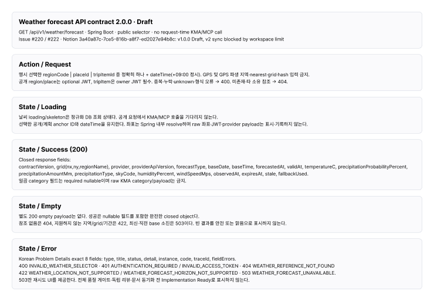

# Weather Figma v2 Draft readback

- 확인일: 2026-09-08
- 파일: https://www.figma.com/design/4mKep38zm17iupVSQVsSJW?node-id=1291-8816
- 기존 backend trace 텍스트 6개와 section 이름을 v2 Draft로 변경했다. product 화면은 수정하지 않았다.
- 실제 font를 로드한 후 변경했고, 후속 API 재조회 및 frame screenshot으로 글자 잘림·겹침이 없음을 확인했다.
- Notion v1.0.0 Draft의 v2 동기화 차단 및 구현 전체 gate 미완료를 카드에 명시했다. 이 근거는 문서 초안 readback이며 Implementation Ready를 의미하지 않는다.



```json
{"frame":{"id":"1291:8817","width":1480,"height":1026},"texts":[{"id":"1291:19723","characters":"Weather forecast API contract 2.0.0 · Draft","height":27},{"id":"1291:19724","characters":"GET /api/v1/weather/forecast · Spring Boot · public selector · no request-time KMA/MCP call\nIssue #220 / #222 · Notion 3a40a87c-7ce5-816b-a8f7-ed2027e94b8c: v1.0.0 Draft, v2 sync blocked by workspace limit","height":48},{"id":"1291:19726","characters":"명시 선택한 regionCode | placeId | tripItemId 중 정확히 하나 + dateTime(+09:00 정시). GPS 및 GPS 파생 지역·nearest·grid·hash 입력 금지.\n공개 region/place는 optional JWT, tripItem은 owner JWT 필수. 중복·누락·unknown·형식 오류 → 400. 미존재·타 소유 참조 → 404.","height":48},{"id":"1291:19728","characters":"날씨 loading/skeleton은 정규화 DB 조회 상태다. 공개 요청에서 KMA/MCP 호출을 기다리지 않는다.\n선택한 공개/계획 anchor ID와 dateTime을 유지한다. 좌표는 Spring 내부 resolve하며 raw 좌표·JWT·provider payload는 표시·기록하지 않는다.","height":48},{"id":"1291:19732","characters":"별도 200 empty payload는 없다. 성공은 nullable 필드를 포함한 완전한 closed object다.\n참조 없음은 404, 지원하지 않는 지역/grid/기간은 422, 최신·직전 base 소진은 503이다. 빈 결과를 안전 또는 맑음으로 표시하지 않는다.","height":48},{"id":"1291:19734","characters":"Korean Problem Details exact 8 fields: type, title, status, detail, instance, code, traceId, fieldErrors.\n400 INVALID_WEATHER_SELECTOR · 401 AUTHENTICATION_REQUIRED / INVALID_ACCESS_TOKEN · 404 WEATHER_REFERENCE_NOT_FOUND\n422 WEATHER_LOCATION_NOT_SUPPORTED / WEATHER_FORECAST_HORIZON_NOT_SUPPORTED · 503 WEATHER_FORECAST_UNAVAILABLE.\n503만 재시도 UI를 제공한다. 전체 품질 게이트·독립 리뷰·문서 동기화 전 Implementation Ready로 표시하지 않는다.","height":96}]}
```
